# 并发-juc

[TOC]


## 知识星球

收录一些有参考过并且有价值的内容网址。

[Java并发 - 理论基础 | Cyan's blog (willpast.github.io)](https://willpast.github.io/pages/java-thread-x-theorty/#_0-思考)

[JMM（Java 内存模型）详解 | JavaGuide](https://javaguide.cn/java/concurrent/jmm.html)

[happens-before是什么？JMM最最核心的概念，看完你就懂了 - 知乎 (zhihu.com)](https://zhuanlan.zhihu.com/p/126275344)

[Java内存模型(JMM) happens-before原则详解_jmm中handsbefore是什么?有哪些规则?-CSDN博客](https://blog.csdn.net/qq_33709508/article/details/105342342)

[黑马程序员深入学习Java并发编程，JUC并发编程全套教程_哔哩哔哩_bilibili](https://www.bilibili.com/video/BV16J411h7Rd/?spm_id_from=333.337.search-card.all.click&vd_source=f910f291916244672e3ab84e2dba2c6a)

[不可不说的Java“锁”事 - 美团技术团队 (meituan.com)](https://tech.meituan.com/2018/11/15/java-lock.html)

[Java等待唤醒机制wait/notify深入解析_notify唤醒-CSDN博客](https://blog.csdn.net/AttleeTao/article/details/110133661)

[volatile底层原理详解 - 知乎 (zhihu.com)](https://zhuanlan.zhihu.com/p/133851347)

[深入理解JVM之Java内存模型 - 个人文章 - SegmentFault 思否](https://segmentfault.com/a/1190000021637869)

[Java多线程进阶（十七）—— J.U.C之atomic框架：LongAdder - 透彻理解Java并发编程 - SegmentFault 思否](https://segmentfault.com/a/1190000015865714)

## 进程线程

## 并发并行

## 同步异步

## 效率提升

充分利用多核cpu的优势，使用多线程提升效率。

多核cpu的多线程存在并行，效率提升比较明显；而单核cpu不存在并行，多线程操作也是并发的，线程时间片切换花费时间，效率负提升。这是针对可以同时进行的任务而言的，但是是否可以提升效率，需要结合具体的业务，比如桌面端UI程序中，多线程就是最常用的，即使使用单核cpu，也不应该因为一个任务的执行让页面卡死，所以使用多线程也会有很大的感知差异，可以带来正反馈的操作也算是效率提升了。

## 创建线程

通过使用`Thread`线程和`Runnable`任务来新建线程。

使用`FutureTask`创建线程任务，用来处理任务有返回结果的情况。

## 用户线程和守护线程

JAVA中的线程主要分为两类：User Thread和Daemon Thread。默认创建的线程都是用户线程；守护线程是为用户线程服务的，当线程中的用户线程都执行结束后，守护线程也会跟随结束。

## 栈与栈帧

Java Virtual Machine Stacks (Java虚拟机栈)
我们都知道JVM中由堆、栈、方法区所组成，其中栈内存是给谁用的呢？其实就是线程，每个线程启动后，虚拟机就会为其分配一块栈内存。

- 每个栈由多个栈帧(Frame)组成，对应着每次方法调用时所占用的内存
- 每个线程只能有一个活动栈帧，对应着当前正在执行的那个方法

## Thread中的方法

- `run()`：线程体，是需要线程执行的内容，直接调用不会新建线程。
- `start()`：启动新线程执行run()线程体内的任务。
- `sleep()`：线程在n时间内暂停。
- `join()`：等待该线程结束。
- `yield()`：尽量让出cpu执行权给其它线程
- `interrupt()`：打断线程。
- `interrupted()`：获取线程中止状态，并重置中止状态。
- `setDaemon()`：设置守护线程。

### interrupt()详解

#### 打断休眠

打断`sleep`、`wait`、`join`的线程。**使线程interrupt布尔值为true**，表示被打断，抛出`InterruptedException`异常，同时**清除中止状态（interrupt被设置为false**）， 打断休眠，异常处理中可以对当前线程任务进行处理，或者重新设置终止状态，这取决于程序员。

#### 打断任务

使用`interrupt()`打断线程实际上只是修改了线程的中止状态值（interrupt），不是真正的让线程停止运行，如果需要让线程停止运行，需要在任务合适的地方手动判断interrupt的值，处理停止逻辑。基于目前的知识和根据interrupt的打断原理，使用[两阶段中止](#设计模式——两阶段中止（TwoPhaseTermination）)可以优雅的停止线程。

#### 打断park

`park()`是`LockSupport`类中的一个静态方法，用来阻塞线程。`LockSupport`并发锁，主要包含两种操作，分别为阻塞操作和唤醒操作。我们更加熟悉的阻塞唤醒操作是`wait/notify`方式，它主要以Object的角度来设计。而`LockSupport`提供的`park/unpark`则是以线程的角度来设计，真正解耦了线程之间的同步。`interrupt()`可以打断用`LockSupport`阻塞的线程，让线程从`park`阻塞中释放，并且**线程标记为打断状态，但不会触发异常**。

## 线程状态

从操作系统层面，线程有5种状态，参考进程的五态模型。为了区分下面用加粗的字表示操作系统层面的状态。


从java API层面分析，线程状态枚举中有6种状态。


- NEW：线程对象已创建但未start。**新建**
- RUNNABLE：线程开启后的正常运行状态，包括了操作系统的**就绪**、**运行**和系统资源分配导致的**阻塞状态**，因为从代码层面上还是在运行。
- BLOCKED：阻塞状态。表示等待某个锁。**阻塞状态**
- WAITING：无限等待。**阻塞状态**
- TIME_WAITING：有限等待。**阻塞状态**
- TERMINATED：终态，线程运行结束。**终态**

## synchronized关键字

`synchronized`是解决临界区的静态条件发生的阻塞式手段之一。阻塞式还包括Lock，非阻塞式手段有原子变量。

>临界区。存在对共享资源的多线程读写的代码块称为临界区，会因为线程的指令交错导致共享资源的不同步。
>
>静态条件。多个线程在临界区内执行，由于代码的执行序列不同导致结果无法预测。

synchronized指定一个对象的锁，当线程获得该锁时，才可以进入`synchronized`代码块内，否则进入等待队列，直到锁被释放，可以再次尝试获取。

### 原理

**每一个对象在同一时间只与一个monitor(锁)相关联，而一个monitor在同一时间只能被一个线程获得**。当线程获得锁时，monitor计数器加一，==释放锁时，计数器减一，完全释放锁后，计数器为0==。

下图表现了对象，对象监视器，同步队列以及执行线程状态之间的关系：


该图可以看出，任意线程对`Object`的访问，首先要获得`Object`的监视器，如果获取失败，该线程就进入同步状态，线程状态变为BLOCKED，当`Object`的监视器占有者释放后，在同步队列中得线程就会有机会重新获取该监视器。

`synchronized`关键字更多深层原理在[Monitor概念篇](#MOnitor概念)中补充

#### 可重入性

请注意上面的高亮，看起来好像会存在计数器大于一的情况，难道代码块不是用完就释放吗？如果`synchronized`代码块是递归方法，或者调用了改锁的其它代码块，就会出现多次调用同步代码块的情况。思考一下，对于这种情况，线程是不是需要重新争取锁才能执行代码块呢，其实不然，线程本身已经获得了锁，在完全释放掉锁前，不需要重新获得改对象锁，而是在计数器上加一，当退出代码块后，计数器减一，这就是`synchronized`的重入性。

### 锁对象

静态方法中只能使用字节码（静态）对象锁，在静态方法上使用字节码对象锁。

非静态方法中可以使用非静态对象、字节码对象和`this`作为锁，在非静态方法上使用this对象锁。


## 谈谈线程安全

### 成员变量和静态变量是否线程安全？

- 如果它们没有共享，则线程安全
- 如果它们被共享了，根据它们的状态是否能够改变，又分两种情况
  - 如果只有读操作，则线程安全
  - 如果有读写操作，则这段代码是临界区，需要考虑线程安全

### 局部变量是否线程安全？

- 局部变量是线程安全的
- 但局部变量引用的对象则未必
  - 如果该对象没有逃离方法的作用访问，它是线程安全的
  - 如果该对象逃离方法的作用范围，需要考虑线程安全

### 常见线程安全类

- String
- Integer
- StringBuffer
- Random
- Vector
- Hashtable
- java.util.concurrent包下的类

其中，String、Integer是不可变类，不可变类对象中的值都是用final修饰的，并且方法返回的都是新对象，不会因为当前实例的值改变导致的错误。对于final的更多知识点在接下来的内容中介绍。

除了不可变对象外，多个线程调用它们同一个**实例**的某个方法时，是线程安全的。也可以理解为

- 它们的每个方法是原子的
- [但注意它们多个方法的组合不是原子的](#线程安全的组合方法)

### 继承可能会破坏线程安全

假设你设计了一个线程安全的类，现在有个人想对你的类进行修改，继承了过去，并且重写了一些方法，就可能导致本来安全的方法变得不安全，使用final修饰类防止继承可以有效解决这个问题。

## Monitor概念

Monitor被翻译为“监视器”或者“管程”，Monitor是Java中一个底层机制，用于确保同一时间只有一个线程能够执行 `synchronized` 代码块或方法。它负责管理线程对某个对象的独占访问，并处理线程的挂起和唤醒。结合对象的锁状态（存储在对象头中）一起工作。

### 对象头

讲monitor之前，首先简单了解一下对象头。以下对象头中锁状态，都是为`synchronized`关键字设计的（gc状态不是），为了优化和管理线程同步操作。

这里以32位系统为例。（64位系统对象头Mark Word区域64位，响应的属性区域大小也会更大）

普通对象

```tex
|------------------------------------------------------------------------------------------------|
|                                   Object Header (64bits)                                       |
|-----------------------------------------------|------------------------------------------------|
|                Mark Word (32bits)             |             Class Word (32bits)                |
|-----------------------------------------------|------------------------------------------------|
```

数组对象

```tex
|--------------------------------------------------|--------------------------------------------------|
|                                      Object Header (96bits)                                         |
|---------------------------------|---------------------------------|---------------------------------|
|        Mark Word (32bits)       |       Class Word (32bits)       |      array length (32bits)      |
|---------------------------------|---------------------------------|---------------------------------|
```

其中Mark Word结构

```tex
|---------------------------------------------------------------|--------------------|
|                     Mark Word(32bits)                         |       state        |
|---------------------------------------------------------------|--------------------|
|   hashcode(25bits)  |  age(4bits)  |   biased_lock:0   |  01  |       Unlocked     | （无锁）
|---------------------------------------------------------------|--------------------|
| thread(23bits) |epoch(2bits) |age(4bits) | biased_lock:1 | 01 |       Biased       | （偏向锁）
|---------------------------------------------------------------|--------------------|
|                  ptr_to_lock_record(30bits)            |  00  | Lightweight Locked | （轻量级锁）
|---------------------------------------------------------------|--------------------|
|                  ptr_to_heavyweight_monitor(30bits)    |  10  | Heavyweight Locked | （重量级锁）
|---------------------------------------------------------------|--------------------|
|                                                        |  11  |    Marked for GC   | （被gc回收）
|---------------------------------------------------------------|--------------------|
```

### 锁的膨胀

在一个线程运行到synchronized时，锁对象的对象头存储的信息会发生变化，锁标志位也会发生改变。假设当前对象为无锁状态（没有线程在临界区内），其中一个线程运行到了临界区，锁对象头的markword区域更新内容，变为偏向锁状态。此时另一个线程运行到该代码块，就会跟第一个线程发生锁竞争，两个线程公平竞争，那么撤销偏向锁、锁状态升级到轻量锁。如果又有多的线程竞争，那么继续膨胀锁状态到重量级锁，MarkWord区域保存monitor地址，此时，对象关联到一个monitor，由monitor去管理线程。

#### 偏向锁

偏向锁是指一段同步代码一直被一个线程所访问，那么该线程会自动获取锁，降低获取锁的代价。

在大多数情况下，锁总是由同一线程多次获得，不存在多线程竞争，所以出现了偏向锁。其目标就是在只有一个线程执行同步代码块时能够提高性能。

当一个线程访问同步代码块并获取锁时，会在**Mark Word里存储锁偏向的线程ID**。在线程进入和退出同步块时不再通过CAS操作来加锁和解锁，而是检测Mark Word里是否存储着指向当前线程的偏向锁。引入**偏向锁是为了在无多线程竞争的情况下尽量减少不必要的轻量级锁执行路径**，因为轻量级锁的获取及释放依赖多次**CAS**原子指令，而偏向锁只需要在置换ThreadID的时候依赖一次CAS原子指令即可。

偏向锁只有遇到其他线程尝试竞争偏向锁时，持有偏向锁的线程才会释放锁，线程不会主动释放偏向锁。偏向锁的撤销，需要等待全局安全点（在这个时间点上没有字节码正在执行），它会首先暂停拥有偏向锁的线程，判断锁对象是否处于被锁定状态。撤销偏向锁后恢复到无锁（标志位为“01”）或轻量级锁（标志位为“00”）的状态。

在对象为偏向锁状态时，观察Mark Word结构，没有hashcode的存储位置，所以**偏向锁和hashcode是互斥存在**的。由于hashcode的延迟生成，当第一次使用对象hashcode之后，才会关闭对象偏向锁。

偏向锁满足一定条件可以重偏向和自动撤销偏向，这是由jvm对该对象锁的监控决定，不展开。

> 偏向锁在JDK 6及以后版本JVM里是默认启用的。可以通过JVM参数关闭偏向锁：-XX:-UseBiasedLocking=false，关闭之后程序默认会进入轻量级锁状态。
>
> **JDK 15之后取消了偏向锁，锁状态为正常、轻量级、重量级**，原因是偏向锁性能收益小，复杂性和维护成本大。

#### 轻量级锁

是指当锁是偏向锁的时候，被另外的线程所访问，偏向锁就会升级为轻量级锁，其他线程会通过**自旋**的形式尝试获取锁，不会阻塞，从而提高性能。

在代码进入同步块的时候，如果同步对象锁状态为无锁状态（锁标志位为“01”状态，是否为偏向锁为“0”），虚拟机首先将在当前线程的**栈帧**中建立一个名为锁记录（Lock Record）的空间，用于存储锁对象目前的Mark Word的拷贝，然后拷贝对象头中的Mark Word复制到锁记录中。

拷贝成功后，虚拟机将使用**CAS**操作尝试将对象的Mark Word更新为指向Lock Record的指针，并将Lock Record里的owner指针指向对象的Mark Word。

如果这个更新动作成功了，那么这个线程就拥有了该对象的锁，并且对象Mark Word的锁标志位设置为“00”，表示此对象处于轻量级锁定状态。

如果轻量级锁的更新操作失败了，虚拟机首先会检查对象的Mark Word是否指向当前线程的栈帧，如果是就说明当前线程已经拥有了这个对象的锁，那就可以直接进入同步块继续执行，否则说明多个线程竞争锁。

*该图表示轻量级锁的重入*

若当前只有一个等待线程，则该线程通过自旋进行等待。但是当自旋超过一定的次数，或者一个线程在持有锁，一个在自旋，又有第三个来访时，轻量级锁升级为重量级锁。

**轻量级锁，在线程少量的情况下，尽量减少了重量级锁中线程上下文切换的次数，通过线程一定时间内的自旋等待代替阻塞。**

> JDK7及以后无法控制轻量级锁的自旋，通过JVM自动判断自旋的度。

#### 重量级锁（同步锁）

本章中的Monitor就是重量锁的原理

### 工作原理


如下图所示，假设锁对象为重量级锁状态。线程2拿到锁，此时Monitor的属性Owner指向线程2，Owner线程可以访问临界区。当线程1，线程2尝试访问临界区时，会被分配到等待队列中，直到线程2彻底释放锁，Owner为空，唤醒等待队列中的线程，再次进行锁竞争。


**Monitor是Java对象与操作系统资源的结合**，每个对象都可以作为锁，作为锁就有机会（隐式）关联一个监视器对象，由JVM管理，监视器中有对操作系统资源的使用，比如信号量、互斥量、线程调度。

## wait/notify

`wait/notify`等待/唤醒机制，是**线程通信**的一种方式，与Monitor有密切关系。使用`wait/notify`**必须当前线程在`synchronized`块中**，且使用的对象必须是当前锁对象，否则会出现**`IllegalMonitorStateException`(非法监视器状态异常)**。线程使用锁对象`wait`会进入等待状态，并且**释放锁**。

如下图所示，`wait`使线程进入Monitor的等待集合中，线程处于WAITING等待状态，被`notify`唤醒后将会进入等待队列中继续竞争锁。

### 方法说明

- `wait()`：在线程获取到锁后，调用锁对象的本方法，线程释放锁并且把该线程放置到与锁对象关联的等待队列（等待线程池）。
- `wait(long timeout)`：等待指定的毫秒数，如果超过指定时间则自动把该线程从等待队列中移出。
- `wait(long timeout, int nanos)`： 与上边的一样，只不过超时时间粒度更小，即指定的毫秒数加纳秒数。
- `notify()`： 唤醒一个在与该锁对象关联的等待队列的线程，一次唤醒一个，而且是任意的。
- `notifyAll()`：唤醒全部：可以将该锁Monitor线程池中的所有wait() 线程都唤醒。

### wait和sleep的区别

**`wait/notify`是对象行为**。`wait`和`notify`是Java对象行为，因为它们是定义在`java.lang.Object`类中的方法，而不是线程或锁的特定行为。每个Java对象都有可能被用作锁，并且任何对象都可以调用这些方法来管理线程同步。需要搭配`synchronized`使用。**会释放锁**。

`sleep`是Thread类方法，不强制搭配`synchronized`使用，**不会释放锁**。

### 同步设计模式——保护性暂停（Guarded Suspension)

在多线程通信中，在一个线程需要等待另一个线程的执行结果，如何避免虚假唤醒和保证有限等待的正确性，保护性暂停可以有效解决这些问题。需要一个对象来管理结果。


观察以下管理执行结果的类，循环语句条件`result == null `和 `(delay = start + timeout - System.currentTimeMillis()) > 0`分别就虚假唤醒和有限等待问题做出了解决。

```java
class GuardedObject {
    Integer result;

    /**
     * 同步获取数据方法，使用保护性暂停设计模式
     *
     * @param timeout 超时时间
     * @return
     */
    public synchronized Integer getResult(long timeout) throws InterruptedException {
        if (timeout > 0) {
            long start = System.currentTimeMillis(); //开始等待时间
            long delay = timeout; //剩余等待时间
            do {
                wait(delay);
            } while (result == null && (delay = start + timeout - System.currentTimeMillis()) > 0);
        } else if (timeout == 0) {
            while (result == null) {
                this.wait();
            }
        }
        return this.result;
    }

    public synchronized void setResult(int x) {
        this.result = x;
        this.notifyAll();
    }
}
```

如果看懂这个代码，恭喜你！同时理解了`Thread.join()`方法原理。与上方代码不同的是，join判断的是线程是否存活。

#### 解耦等待和生产

如果需要在多个类之间使用`GuardedObject`对象，作为参数传递不是很方便，因此设计一个用来解耦的中间类，这样不仅能够解耦【结果等待者】和【结果生产者】，还能够同时支持多个任务的管理。[代码区](#保护性暂停之解耦等待和生产)。

结合代码和图示，可以看出，在保护性暂停基础上，加了一个解耦类，用来统一和维护**一对一**的结果对象。


### 异步设计模式——生产者消费者模式

生产者消费者模式中解耦了生产者和消费者（线程），不需要一一对应。消息是放着一个消息队列中的，队列满足接收消息的请求时，生产者可以直接发送消息，不需要等待和关注消费者的处理；队列满时生产者等待；队列空时消费者等待。平衡生产者和消费者变得简单，如果消费者的速度比生产者生产的速度慢，那么可以添加消费者，反之同理。


以下代码是一个简单消息队列的实现。

```java
@Slf4j(topic = "c.queue")
class MessageQueue {
    private final LinkedList<Message> queue = new LinkedList<>();
    private final int capacity; //队列大小

    public MessageQueue(int capacity) {
        this.capacity = capacity;
    }

    //存
    public void put(Message message) throws InterruptedException {
        synchronized (queue) {
            while (queue.size() == capacity) {
                log.debug("队列满了，等一下");
                queue.wait(); //满队列 等待
            }
            queue.addLast(message);
            queue.notifyAll(); //在空队列的情况下唤醒一下等待的消费者。
        }
    }
    //取
    public Message take() throws InterruptedException {
        synchronized (queue) {
            while (queue.isEmpty()) {
                log.debug("队列空了，等一下");
                queue.wait(); //等待消息
            }
            Message meg = queue.removeFirst();
            queue.notifyAll(); //在满队列的情况下唤醒等待存放的生产者。
            return meg;
        }
    }
}
```

## JUC-LockSupport

LockSupport用来创建锁和其他同步类的基本线程阻塞原语。简而言之，当调用`LockSupport.park`时，**表示当前线程将会等待**，直至获得许可，当调用`LockSupport.unpark`时，必须把等待获得许可的线程作为参数进行传递，好让此线程继续运行。

LockSupport和每个使用它的线程都有一个许可关联（对象），管理线程的许可状态，许可且最多只有一个。`park`消耗许可，`unpark`增加许可，但累加无效。

以下图片是许可的底层实现原理。

- Parker-0。可以理解为是一个管理线程许可状态的内部数据结构。
- \_counter。许可状态。1表示拥有许可，0表示没有许可。
- \_mutex。互斥锁。确保_counter的更新操作是原子的。
- \_cond。条件变量。判断许可状态。

当线程使用`park`方法时，在条件变量中判断当前线程许可状态，如果无许可，则在条件变量中等待，直到许可重新出现，将许可置为0，并退出等待状态；如果一开始判断就有许可，则不需要等待，直接将许可置为0，并退出等待状态。


除了无参`park()`方法，还有一些带`Object blocker`和`long deadline`参数的。带时间的就是设置等待的时间，超时停止等待。`blocker`参数在线程等待前被`setBlocker(t,blocker)`用来设置`Thread`对象上的`parkBlocker`的对象，结束等待后会再次调用`setBlocker(t, null)`把对象置为空，在阻塞过程中可以通过`getBlocker(t)`方法获得某个线程的`parkBlocker`，可以通过自定义的对象用来知道线程的等待的位置或者原因。主要是用来做等待原因校验的。

### `park`和`sleep`方法的异同

- 都是**阻塞当前线程的执行，且都不会释放当前线程占有的锁资源；**
- `Thread.sleep`方法声明上抛出了`InterruptedException`中断异常，所以调用者需要捕获这个异常或者再抛出；
- `LockSupport.park`方法**不需要捕获中断异常**；
- `Thread.sleep`本身就是一个native方法；
- `LockSupport.park`底层是调用的Unsafe的native方法；

## 多把锁

在一个对象中，某些方法间不需要同步，但是方法内需要同步，如果使用对象锁或者同一个锁，就会导致并发效率低。此时可以使用多把锁，对互不影响的同步方法分别加上不同的锁，增加细粒度，提高并发效率。多把锁的使用需要注意死锁现象的发生。

## 线程活跃性问题

### 死锁

线程释放当前锁资源的条件被其它线程所占有，且其它线程的锁资源释放条件也被另外的线程占有，所有线程都在等待其它锁资源的释放，这种现象就是死锁。

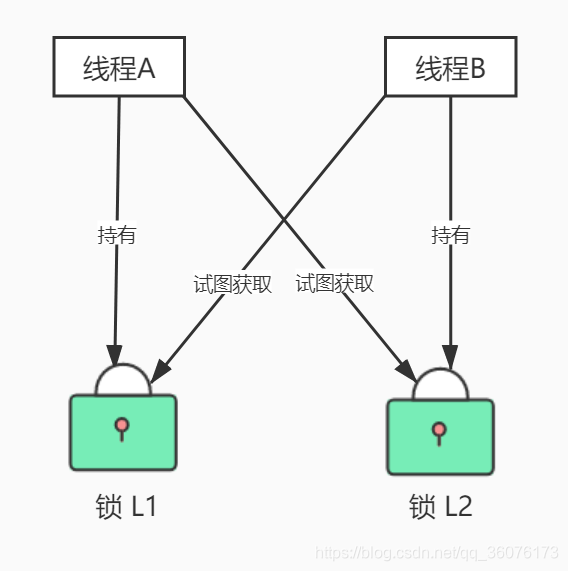

### 活锁

**活锁**是指线程一直处于**运行状态**，但是其任务一直无法进展的一种活性故障。比如一个线程一直计算某个值，直到某个条件，而另一个线程就在不断重置这个值，导致任务无法进展。

### 饥饿

线程**饥饿**是指线程一直无法获得其所需的资源而导致其任务一直无法进展的一种活性故障。比如线程优先度过低、线程需要获得的锁无法被其它线程释放等会导致线程饥饿。

## JUC-ReentrantLock

`RenntrantLock`是JUC中的一个**可重入锁**实现，底层使用**AQS**实现。它是一种同步机制，在复杂的多线程环境下提供比`synchronized`更丰富的功能。

相比于`synchronized`它具有以下特点

- 可中断
- 可设置超时时间
- 可设置为公平锁
- 支持多个变量条件

使用`lock()`的最佳实践是把临界区的代码放在`try-finally`中，确保退出临界区后释放锁。

```java
ReentrantLock lock = new ReentrantLock();    
lock.lock();
try {
    //临界区
} finally {
    //确保释放锁
    lock.unlock();
}
```

RenntrantLock中的其它常用方法：

- `lockInterruptibly()`：可打断的lock()
- `boolean tryLock()`：判断并尝试获得锁，如果获取不到则返回`false`
- `boolean tyrLock(long, TimeUnit)`：尝试在设定时间内获取锁，获取到返回`true`，超时则返回`false`
- `ReentrantLock(boolean)`：构造函数，`true`设置公平锁，默认为非公平锁。


还记得synchronized中的`wait/notify`吗，RenntrantLock中的Condition能让线程进入条件等待并且支持多个等待条件。通过实例不同的**单向**条件队列实现。

```java
static Condition condition1 = new newCondition();
static Condition condition2 = new newCondition();

//临界区
{
    //当前线程进入/退出某个条件队列。
    condition1.await();/condition1.signalAll();
}
```


关于RenntrantLock的具体实现细节参考AQS章节。

## **JUC-AQS

### AQS简介

AQS全称`AbstractQueuedSynchronizer`，抽象队列同步器，JUC最重要的基石。AQS**统一规范并简化了锁的实现**：屏蔽了同步状态管理、同步队列的管理和维护、阻塞线程排队和通知、唤醒机制等，抽象出来一切锁和同步组件实现的**公共基础部分**。

### AQS核心思想

AQS核心思想是，如果被请求的共享资源空闲，则将当前请求资源的线程设置为有效的工作线程，并且**将共享资源设置为锁定状态**。如果被请求的共享资源被占用，那么就需要**一套线程阻塞等待以及被唤醒时锁分配的机制**，将暂时获取不到资源的线程加入到队列中。

AQS使用一个int类型的成员变量来表示**同步状态**，使用CLH队列来实现（FIFO）排队的**双向队列**。

>CLH(Craig,Landin,and Hagersten)队列是一个**虚拟的双向队列**(虚拟的双向队列即不存在队列实例，仅存在结点之间的关联关系)。AQS是将**每条请求共享资源的线程**封装成一个CLH锁 **队列的一个结点(Node)** 来实现锁的分配。

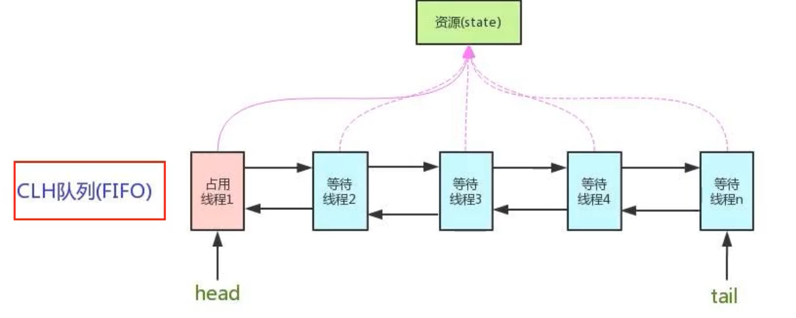

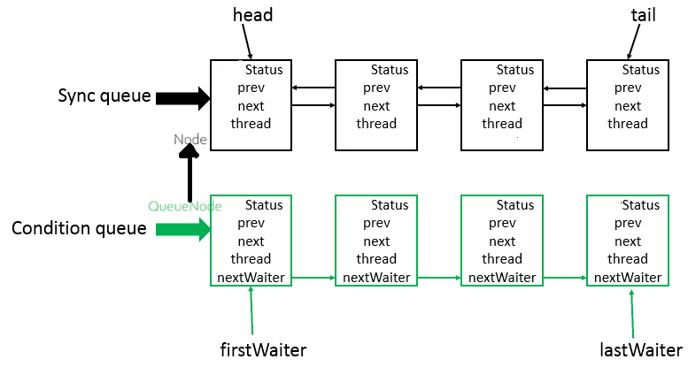

### 源码分析

在JDK17中，AQS源码与网上大多数教程中的旧源码有一些区别，比如Node类的状态。这里主要结合旧源码分析一下JDK17版本中的源码，希望在没有新版本网络教程的情况下难不倒我们。对于一些不太重要或者与网上教程差不多的地方就不一一分析了。

AQS作为一个同步框架，提供了一套同步机制，定义获得和释放同步资源需要使用框架的人实现，使用模板方法（设计模式）来实现自定义规则。我们要知道对于以下方法必须由框架使用者实现，默认抛出异常：

- tryAcquire 独占模式。尝试获取资源。
- tryRelease 独占模式。尝试释放资源。
- tryAcquireShared 共享模式。尝试获取资源。
- tryReleaseShared 共享模式。尝试释放资源。
- isHeldExclusively 该线程是否正在独占资源。与condition相关的。

#### 继承关系

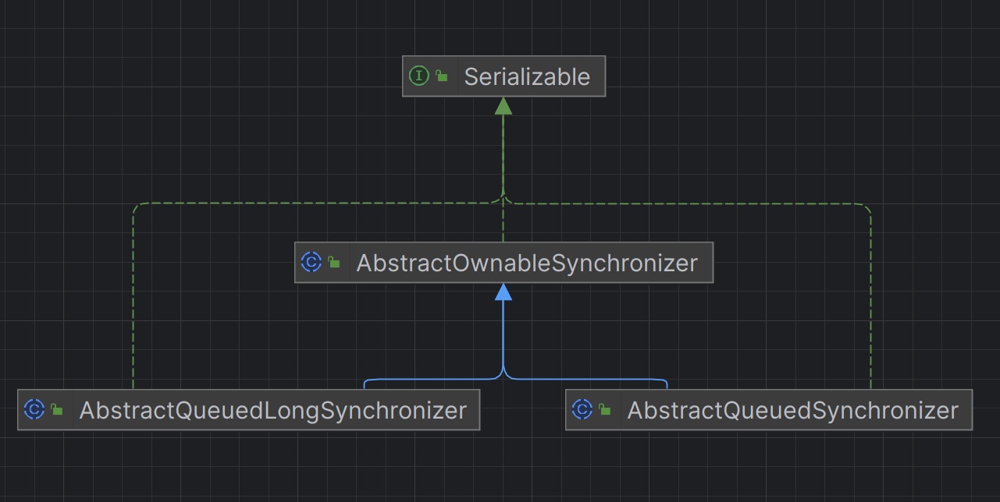

AQS类中节点不同类型节点关系。

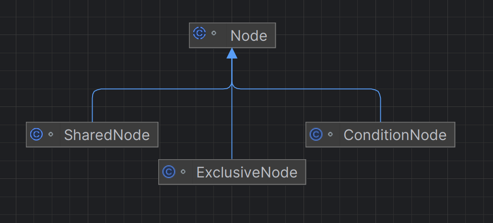

AQS中还有一个`ConditionObject`类，用来实现条件队列。

#### 线程节点状态

```java
static final int WAITING   = 1;          // 同步等待状态
static final int CANCELLED = 0x80000000; // 取消状态，这里有注释表示了一定是负数
static final int COND      = 2;          // 条件等待状态
```

#### 获取资源主方法 acquire

```java
/**
    主获取方法，由所有导出的获取方法调用。
    形参:
    node–null，除非有重新获取条件arg–获取参数shared–true，如果共享模式否则独占可中断–如果中止并在中断定时时返回负数–如果为true，则使用定时等待时间–如果为定时，则使用System.nanoTime值超时
    返回值:
    如果获得，则为正，如果超时，则为0，如果中断，则为负
*/
final int acquire(Node node, int arg, boolean shared,
                  boolean interruptible, boolean timed, long time) {
    Thread current = Thread.currentThread();
    byte spins = 0, postSpins = 0;   // 在第一个线程未标记时重试???
    boolean interrupted = false, first = false;
    Node pred = null;                // 排队时节点的前驱

    // 自旋 到最后还是获取不到资源就进队列
    for (;;) {
        // 如果node为空，则前驱节点为空，否则pred指向前驱节点
        // 如果pred不为空，且头节点不是pred
        if (!first && (pred = (node == null) ? null : node.prev) != null &&
            !(first = (head == pred))) {
            if (pred.status < 0) { // 如果前驱是取消态
                cleanQueue();           // 从后往前清除已取消的节点
                continue;
            } else if (pred.prev == null) { // 前驱的前驱是空的
                Thread.onSpinWait();    // 线程忙等待，自旋优化
                continue;
            }
        }
        // 前驱节点是头节点 或者 前驱节点是空
        if (first || pred == null) {
            boolean acquired;
            try {
                if (shared) 
                    acquired = (tryAcquireShared(arg) >= 0); // 共享模式 尝试获取资源。
                else 
                    acquired = tryAcquire(arg); // 独占模式 尝试获取资源。
            } catch (Throwable ex) {
                cancelAcquire(node, interrupted, false); // 没定义获取规则就取消获取。
                throw ex;
            }
            if (acquired) { // 成功获取资源
                if (first) { // 且前驱是头节点，把当前节点置为头节点
                    node.prev = null;
                    head = node;
                    pred.next = null;
                    node.waiter = null;
                    if (shared)
                        signalNextIfShared(node); // 共享模式 唤醒其它节点
                    if (interrupted)
                        current.interrupt(); // 如果被打断过，则设置一下中断状态
                }
                return 1; // 获取到资源 返回1
            }
        }
        //到这里表示线程拿不到资源，需要进等待队列了，前提需要将线程包装进节点中。每一次自旋都会为节点进入队列做准备。
        if (node == null) {                 // 创建一个节点
            if (shared)
                node = new SharedNode();
            else
                node = new ExclusiveNode();
        } else if (pred == null) {          // 尝试排队
            node.waiter = current;
            Node t = tail;
            node.setPrevRelaxed(t);         // avoid unnecessary fence
            if (t == null)
                tryInitializeHead();
            else if (!casTail(t, node))
                node.setPrevRelaxed(null);  // back out
            else
                t.next = node;
        } else if (first && spins != 0) {
            --spins;                        // 前驱是头节点，继续自旋，减少重新等待的不公平性。
            Thread.onSpinWait();
        } else if (node.status == 0) {
            node.status = WAITING;          // 自旋
        } else { // 在最后一次自旋中，是否要为线程等待设置超时时间。
            long nanos;
            // postSpins*2+1
            spins = postSpins = (byte)((postSpins << 1) | 1);
            if (!timed)
                LockSupport.park(this); // 线程在这里进行无限等待
            else if ((nanos = time - System.nanoTime()) > 0L)
                LockSupport.parkNanos(this, nanos); // 线程在这里进行有限等待
            else
                break;
            node.clearStatus();
            // interrupted = Thread.interrupted() | interrupted 即记录是否被中断过
            // 如果被中断过且是可打断的，就退出等待，否则被唤醒继续抢资源。
            if ((interrupted |= Thread.interrupted()) && interruptible)
                break;
        }
    }
    return cancelAcquire(node, interrupted, interruptible); // 超时和被中断的 取消获取资源
}
```

取消等待获取资源`cancelAcquire()`

```java
/**
    取消正在进行的获取尝试。
    形参:
    node-节点（如果在查询前取消，则可能为空）中断-如果线程中断可中断，则为true-如果应报告中断与重置
 */
private int cancelAcquire(Node node, boolean interrupted,
                          boolean interruptible) {
    if (node != null) { // 清除节点 设置节点状态 清除队列
        node.waiter = null;
        node.status = CANCELLED;
        if (node.prev != null)
            cleanQueue();
    }
    if (interrupted) { // 线程被打断过
        if (interruptible) // 且可被打断
            return CANCELLED; // 返回负数 表示被打断
        else
            Thread.currentThread().interrupt();  // 重新设置中断状态为true
    }
    return 0; // 返回0表示超时
}
```

#### 独占资源

独占资源的获取是一个重载方法`acquire(int arg)`

```java
public final void acquire(int arg) {
    if (!tryAcquire(arg))
        acquire(null, arg, false, false, false, 0L);
}
```

根据分析两个`acquire()`方法，可以知道独占模式下获取资源的过程。首先调用自定义获取资源方法`tryAcquire(arg)`来尝试获取资源，如果获取不到则调用`acquire(null, arg, false, false, false, 0L)`来尝试获取加入队列：

**第一次自旋**，尝试获取资源，如果获取失败，则实例化一个`ExclusiveNode`；**第二次自旋**，尝试获取资源，失败则把当前线程包装到刚刚实例的Node对象中，并把尾节点的next节点设为当前Node对象，Node对象前节点设为尾节点，把Node对象设置为尾节点；**第三次自旋**，如果前驱节点不是头节点，首先看看是否需要对列表做修正（在这之后的自旋每一次都要，除非前驱节点是头节点），修正后重新自旋，假设需要修正，**进入第四次自旋**，假设前驱不是头节点，修改节点对象为WAITING状态；**第五次自旋**，从节点状态为WAITING状态开始之后的每次自旋中，如果前驱是头节点，则尝试获取；如果不是或者获得失败，判断是否有限等待，并对应的进行等待。这里会计算一个spins（旋转）值，如果前驱是头节点，则在唤醒后会进行多spins值的自旋。**更多自旋后**，超时或者被打断则退出等待队列。

以上分析是对AQS入队流程的基本分析，实际情况可能并不是简单的5次自旋就完全进入等待队列中等待了，这是一个动态调整的过程。

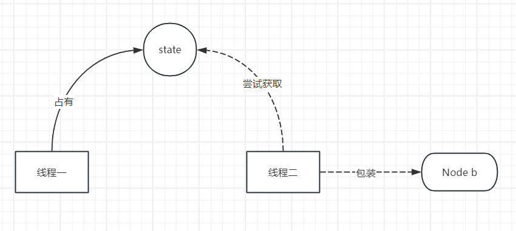

通过以上的分析，可以知道AQS的获取资源并不是公平的，即使一个线程已经排了很久的队，但是还是可能会被其它线程插队获取到资源。虽然底层源码决定了资源获取必然会自旋几次来抢锁，但是可以在`tryAcquire()`中自定义公平的获取方式，比如`ReentrantLock`就是通过判断队列大小来实现公平锁。 

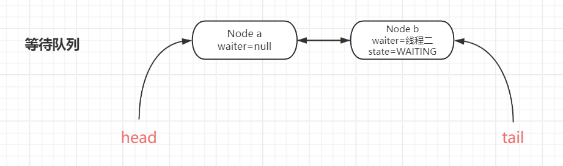

释放资源`release(int)`

```java
public final boolean release(int arg) {
    if (tryRelease(arg)) { // 尝试释放资源（自定义）
        signalNext(head);  // 唤醒后继节点
        return true;
    }
    return false;
}
```

#### 共享资源

获取共享资源方法`acquireShared(int)`

```java
public final void acquireShared(int arg) {
    if (tryAcquireShared(arg) < 0) // 尝试获取共享资源（自定义） 返回值：失败时为负值；如果共享模式下的获取成功，但后续共享模式获取无法成功，则为零；如果共享模式下的获取成功并且后续共享模式获取也可能成功，则为正值。
        acquire(null, arg, true, false, false, 0L); // 第三个尝试为true表示共享模式。
}
```

在`acquire()`中，资源的自旋和独占模式的**基本一样**，不同的是共享模式在获取资源成功后多了个`signalNextIfShared(Node)`

```java
/** 共享模式中唤醒给定节点 */
private static void signalNextIfShared(Node h) {
    Node s; // 后驱节点
    if (h != null && (s = h.next) != null &&
        (s instanceof SharedNode) && s.status != 0) {
        s.getAndUnsetStatus(WAITING); // 修改节点状态 (1&(~1))=0，解析见如何方法注释。
        LockSupport.unpark(s.waiter); // 恢复节点运行状态。
    }
}

final int getAndUnsetStatus(int v) {
    // 该方法修改STATUS属性，修改结果是通过当前STATUS值和~v按位与结果。
    return U.getAndBitwiseAndInt(this, STATUS, ~v);
}
```

释放资源和独占模式几乎一样，差别就在两者自定义实现的方法不同。

通过以上分析可知，**共享模式是在线程获取资源成功后就会立即唤醒后驱节点，直到共享资源已被限制获取**；与独占模式不同的是，独占模式是在线程释放资源之后再唤醒后驱节点。

#### 条件队列

条件队列中的节点是`ConditionNode`，是Node的子类。注意这里继承了`ForkJoinPool.ManagedBlocker`，节点的两个方法都是实现它的。

```java
static final class ConditionNode extends Node
    implements ForkJoinPool.ManagedBlocker {
    ConditionNode nextWaiter;            // 只记录后驱节点

	/** 
	* 检查当前线程是否可唤醒 
	* 当资源即将释放（已经释放） 或者线程的等待被打断 表示是可释放的 即满足运行条件，可以被唤醒。
	* 当资源可能不能即将释放，并且线程没有被打断等待，表示不可释放 即应该继续阻塞。
	*/
    public final boolean isReleasable() {
        return status <= 1 || Thread.currentThread().isInterrupted(); 
    }

    /** 阻塞线程 */
    public final boolean block() {
        // 当线程未达到释放条件，则park线程，直到满足释放条件。
        while (!isReleasable()) LockSupport.park();
        return true;
    }
}
```

条件等待的核心方法是如何在条件队列中等待和唤醒，首先分析一下等待中最简单的一个：不可被打断的条件等待。

```java
/** 条件等待且无法打断 */
public final void awaitUninterruptibly() {
    ConditionNode node = new ConditionNode();
    int savedState = enableWait(node); // 初始化节点，将节点添加到条件列表结尾并尝试释放资源，并记录当前线程的资源获取次数，方便恢复。
    LockSupport.setCurrentBlocker(this); // 设置线程阻塞原因
    boolean interrupted = false, rejected = false;
    while (!canReacquire(node)) { // 当不可重新获取（canReacquire找节点在不在等待队列中）
        if (Thread.interrupted())
            interrupted = true;
        else if ((node.status & COND) != 0) { // 即线程状态不是0（被送到等待队列了），在enableWait()中，把节点状态设置为（CODN | WAITING）即3
            try {
                if (rejected) // 手动阻塞
                    node.block();
                else
                    ForkJoinPool.managedBlock(node); // 这个线程池用来管理阻塞线程的方法，保持线程池的活性，避免线程池所有的线程阻塞。这个以后再说。
            } catch (RejectedExecutionException ex) { // 一个隐式抛出的异常，如果线程池被取消或者超出线程限制就会抛出这个异常。
                rejected = true; // 此时就不能依赖线程池的线程管理，需要手动阻塞线程。
            } catch (InterruptedException ie) {
                interrupted = true;
            }
        } else
            Thread.onSpinWait();
    }
    LockSupport.setCurrentBlocker(null); // 被唤醒 清除阻塞原因
    node.clearStatus(); // 清除节点状态
    acquire(node, savedState, false, false, false, 0L); // 加入等待队列
    if (interrupted)
        Thread.currentThread().interrupt();
}
```

通过分析以上代码可知，当线程调用某个条件队列的不可打断等待方法时，首先将线程包装成一个`ConditionNode`节点，其次把节点添加到条件队列结尾，释放并保存占有的资源数，设置Blocker阻塞原因；之后使用`ForkJoinPool`线程池来管理阻塞线程，当线程池阻塞失效时手动阻塞，阻塞方法两者都是使用节点的`block()`方法来判断是否阻塞，直到该节点在等待队列中出现；恢复线程状态，尝试获取资源，完全交给等待队列管理。

`await`方法家族中还有其它方法，有普通可打断等待`await()`、有限等待`await(long, TimeUnit)`等，虽然不同方法的使用场景不同，但是原理是相同的。

了解了线程如何在条件队列中等待的，下面再来看一下线程如何从条件队列中转移到等待队列的。

在源码中可以找到三个方法与转移队列有关：doSignal、signal、signalAll

```java
/** 将等待时间最长的线程（头节点）从此条件的等待队列移动到拥有锁的等待队列。 */
public final void signal() {
    ConditionNode first = firstWaiter;
    if (!isHeldExclusively())
        throw new IllegalMonitorStateException();
    if (first != null)
        doSignal(first, false);
}
/** 将此条件队列下的所有线程从等待队列移动到拥有锁的等待队列。 */
public final void signalAll() {
    ConditionNode first = firstWaiter;
    if (!isHeldExclusively())
        throw new IllegalMonitorStateException();
    if (first != null)
        doSignal(first, true);
}
/** 删除并转移一个或所有服务员到同步队列。 */
private void doSignal(ConditionNode first, boolean all) {
    while (first != null) {
        ConditionNode next = first.nextWaiter;
        if ((firstWaiter = next) == null)
            lastWaiter = null;
        // 获得节点当前状态，并设置为0
        if ((first.getAndUnsetStatus(COND) & COND) != 0) {
            enqueue(first); // 把节点加入到等待队列尾部
            if (!all)
                break;
        }
        first = next; // 头节点向后移动
    }
```

`signal()`和`signalAll()`代码上看基本一样，唯一不同的是调用的`doSignal`。doSignal从代码上看也是非常简单，清除头节点的状态并加入到等待队列。

条件队列中等待和唤醒的简单过程图示：

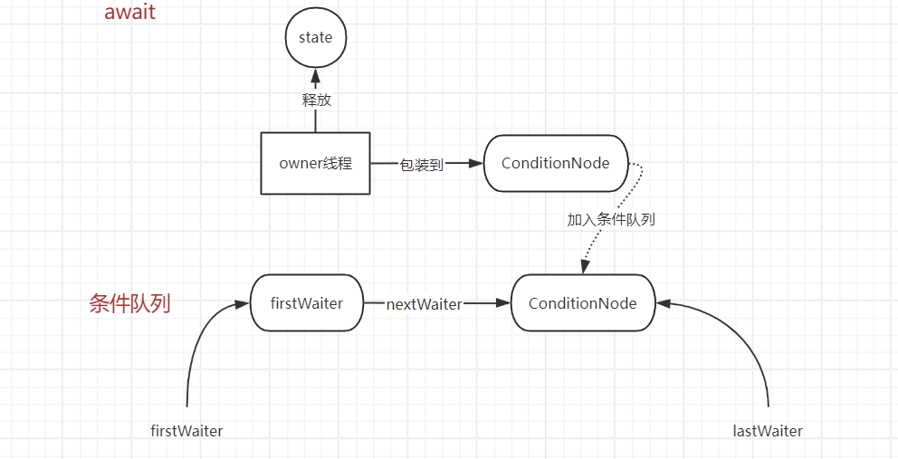

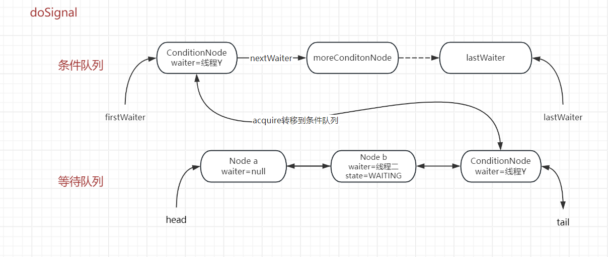

### AQS总结

- AQS就是state+CLH
- AQS是一个同步框架
- 默认是非公平锁

## JUC-ReentrantLock源码

现在，我们已经知道了AQS的实现细节，我们再来看一下AQS原理的实现之一ReentrantLock是如何使用AQS并进行扩展的。

从类图可以看出，ReentrantLock内部抽象类`Sync`继承了AQS，是核心类，子类`FairSync`和`NonfairSync`是公平类和非公平类的实现。

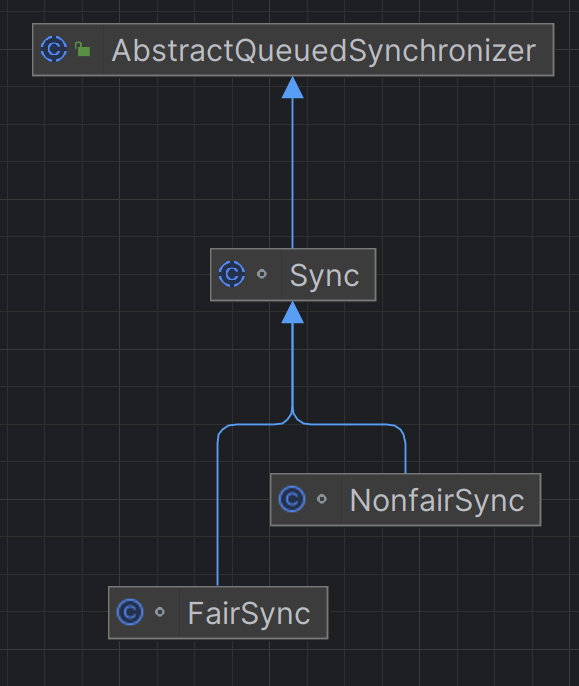

### 可重入

`lock()`是ReentrantLock比较常用的一个同步方法，从它进行分析。`ReentrantLock.lock()`直接调用的内部类`Sync.lock()`，先来看看源码

```java
@ReservedStackAccess
final void lock() {
    if (!initialTryLock()) // 直译初始尝试锁定
        acquire(1);
}
```

> `@ReservedStackAccess` 是 JDK 内部的一个注解，它主要用于标记在某些特殊情况下可以直接访问栈内存的 Java 方法。该注解主要用于 JDK 内部，普通开发者一般不会在应用程序中使用它。它的主要目的是提高性能或处理一些特定的系统操作，尤其是与本地代码或 JVM 紧密交互的地方。

调用父类方法`acquire(int)`之前进行了一个判断，再来看一下`initialTryLock()`，这是个内部类Sync的抽象方法，这里展示的是`NonfairSync`的实现

```java
final boolean initialTryLock() {
    Thread current = Thread.currentThread();
    if (compareAndSetState(0, 1)) { // 先尝试抢一下资源
        setExclusiveOwnerThread(current);
        return true;
    } else if (getExclusiveOwnerThread() == current) { // 此处重入的核心代码
        int c = getState() + 1; // 重入成功则资源状态数加一
        if (c < 0) // overflow
            throw new Error("Maximum lock count exceeded");
        setState(c);
        return true;
    } else
        return false; // 抢不到锁也不是重入，表示需要排队了
}
```

在这里看到了可重入的核心代码，如果判断出线程再次进入锁区域，就把资源状态值在原来的基础上加一，即`state-1`表示重入的次数。如state=5，表示重入了四次。

知道了如何重入，也不难猜出它是如何退出重入的，可能是资源数减一，来看接下来的源码分析。`ReentrantLock.unlock()`是释放资源的方法，它直接调用的AQS的`release(int)`，最终使用的是自定义的`tryRelease(int)`来释放资源

```java
@ReservedStackAccess
protected final boolean tryRelease(int releases) { // 参数是"1"
    int c = getState() - releases; // 目标资源数
    if (getExclusiveOwnerThread() != Thread.currentThread()) // 当前线程是否owner线程
        throw new IllegalMonitorStateException();
    boolean free = (c == 0); // 释放？
    if (free)
        setExclusiveOwnerThread(null); // 释放
    setState(c); // 设置目标资源数
    return free;
}
```

跟踪`releases`参数的值为1，所以当unpark时，当前合法线程获取到的资源数减1，直到为0时`tryRelease(int)`返回`true`，线程才正式让出owner位置。

### 公平锁

公平锁细节在`FairSync`实现的两个方法中，直接来看

```java
final boolean initialTryLock() {
    Thread current = Thread.currentThread();
    int c = getState();
    if (c == 0) {
        if (!hasQueuedThreads() && compareAndSetState(0, 1)) {
            setExclusiveOwnerThread(current);
            return true;
        }
    } else if (getExclusiveOwnerThread() == current) {
        if (++c < 0) // overflow
            throw new Error("Maximum lock count exceeded");
        setState(c);
        return true;
    }
    return false;
}
```

```java
protected final boolean tryAcquire(int acquires) {
    if (getState() == 0 && !hasQueuedPredecessors() &&
        compareAndSetState(0, acquires)) {
        setExclusiveOwnerThread(Thread.currentThread());
        return true;
    }
    return false;
}
```

这里跟`NonfairSync`中的实现基本一样，仔细看可以知道就是在尝试抢资源前多个`!hasQueuedPredecessors()`（已排队处理前置任务）

```java
public final boolean hasQueuedPredecessors() {
    Thread first = null; Node h, s;
    if ((h = head) != null && ((s = h.next) == null ||
                               (first = s.waiter) == null ||
                               s.prev == null))
        first = getFirstQueuedThread(); // retry via getFirstQueuedThread
    return first != null && first != Thread.currentThread();
}
```

判断队列中有没有其它线程排队。如果有就不抢资源，如果没有或者排第一的就是当前线程，则公平的获取资源。

## JMM

学过计算机组成的都知道计算机在内存和cpu之间还有一层Cache高速缓存，cpu操作数需要先从内存读到缓存，而程序变量是存在内存中的，那么在多线程的情况下就可能会出现Cache和内存的数据不一致的情况。比如线程a从内存中拿到数据0，需要对其加一后从Cache写回内存，如果线程a还未将新结果写回内存或者线程a阻塞过程中，线程b又从内存拿了数据0，对其加一，最后写回内存的都是1，但实际上已经进行了两次加一，结果应该是2。在这个例子中就出现了可见性和原子性问题。

>**多线程环境下的可见性、原子性和有序性**问题：
>
>可见性问题：不同线程对同一变量的修改**未必立刻更新**到主内存，其他线程可能会继续使用旧的缓存值。
>
>原子性问题：如果两个线程同时执行 `i++`，可能会出现**丢失更新**的问题，导致最终结果不符合预期。
>
>有序性问题：编译器和处理器的**重排序**，可能导致在多线程中，线程看到的执行顺序与编写的代码顺序不一致。

### JMM简介

JMM(Java内存模型Java Memory Model,.简称JMM)本身是一种抽象的概念，是一组**约定或规范**，通过这组规范==定义了程序中（尤其是多线程）各个变量的读写访问规则并决定一个线程对共享变量的写入何时以及如何变成对另一个线程可见==，关键技术点都是围绕多线程的**原子性、可见性和有序性**展开的。

**JMM其主要目的是为了简化多线程编程，增强程序可移植性。**实际上，java可以直接复用操作系统的内存模型，但是不同的操作系统实现不同，难以复用，使用JMM则屏蔽了系统差异。

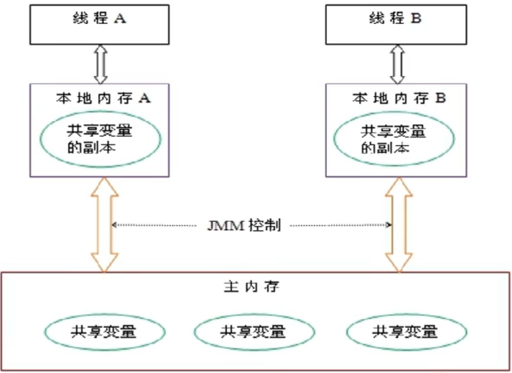

> 主内存：程序中所有的运行时数据都存放在主内存中。
>
> 本地内存：每个线程都有一个私有的本地内存，本地内存存储了该线程以读 / 写共享变量的副本。每个线程只能操作自己本地内存中的变量，无法直接访问其他线程的本地内存。如果线程间需要通信，必须通过主内存来进行。**本地内存是 JMM 抽象出来的一个概念，并不真实存在**，它涵盖了缓存、写缓冲区、寄存器以及其他的硬件和编译器优化。

所谓的“本地内存”，就是从内存中读取数据到高速缓存、寄存器、执行指令等操作后，最终再写回到内存的这个“数据离开内存，再回到内存”的时间段内的抽象概念，也是多线程可能导致数据不一致的关键时间段。程序员通过语言特性（volatile、synchronized等）编写符合JMM规范的代码，JVM负责在运行时依据JMM规范控制本地内存和主内存的并发行为。

### 三大特性

#### 原子性

一次或多次操作，要么全部成功执行，要么都不执行。

使用synchronized、各种Lock等。

#### 可见性

当一个线程对共享变量进行了修改，其它线程可以立即看到修改后的最新值。

使用synchronized、volatile、各种Lock等。

#### 有序性

禁止指令重排序，代码如何编写就如何执行。

volatile、final可以禁止指令重排序。

### happens-before原则

happens-before（先行发生）原则是JMM抽象出来的一套面向程序员的规范。程序员追求强内存模型，要求程序准允编码顺序；编码器和处理器追求少约束的弱内存模型，尽己所能的优化性能。 而**happens-before 原则的诞生是为了程序员和编译器、处理器之间的平衡**。

happens-before简单来讲就是要求了**前一个操作的执行结果刷新回内存发生在后一个操作之前，保证前一个操作结果对后一个操作的可见性**。

**happens-before的设计思想：**

- 对于会改变程序执行结果的重排序，JMM要求编译器和处理器必须禁止重排序。
- 而为了对编译器和处理器的约束尽可能少，只要执行结果不改变，可以任意重排序优化。


**JMM和happens-before的关系：**

JMM的设计包含两部分，一部分是**面向我们程序员**提供的，也就是happens-before规则，它通俗易懂的向我们程序员阐述了一个强内存模型，我们只要理解 happens-before规则，就可以编写并发安全的程序了。 另一部分是**针对JVM实现的**，为了尽可能少的对编译器和处理器做约束，从而提高性能，JMM在不影响程序执行结果的前提下对其不做要求，即允许优化重排序。 


#### happens-before规则

- **程序次序规则**：一个线程内，按照代码顺序，书写在前面的操作先行发生于书写在后面的操作；
- **锁定规则**：一个unLock操作先行发生于后面对同一个锁额lock操作；
- **volatile变量规则**：对一个volatile域的写，happens-before于任意后续对这个volatile域的读
- **传递规则**：如果A happens-before B，且B happens-before C，那么A happens-before C
- **线程启动规则**：如果线程A执行操作ThreadB.start()（启动线程B），那么A线程的ThreadB.start()操作- happens-before于线程B中的任意操作
- **线程中断规则**：对线程interrupt()方法的调用先行发生于被中断线程的代码检测到中断事件的发生；
- **线程终结规则**：线程中所有的操作都先行发生于线程的终止检测，我们可以通过Thread.join()方法结束、Thread.isAlive()的返回值手段检测到线程已经终止执行；
- **对象终结规则**：一个对象的初始化完成先行发生于他的finalize()（gc回收）方法的开始；

## volatile关键字

### volatile介绍

`volatile`关键字是Java提供的最轻量级的同步机制。用于修饰变量，在多线程情况下保证变量修改后立即被其它线程看到。**提供可见性和有序性，但不能保证原子性。**

当把一个变量声明为**volatile**后，编译器和运行时会注意到这个变量是共享的，不会将该变量的操作进行重排序。而且该变量在读取到高速缓存后强制刷新到内存中，其它线程中该变量的缓存会失效，并从内存中取新值。

### 可见性

首先来看一个经典的因为[工作内存和主存不同步导致的数据不一致问题](#工作内存和主存数据不同步问题)，在这个例子中，修改`flag`的值不能影响`while`的判断，从而导致线程不能跳出`while`循环。其根本原因是`while`线程中的`flag`变量是从工作内存中获取的，没有刷新缓存，**那么缓存会在什么时候更新？**

- **线程的上下文切换**：一些同步锁，线程休眠等操作，让线程被操作系统挂起或重新调度，会使线程重新读取主内存中的变量。
- **I/O操作**：线程执行了I/O操作（打印日志、读写文件等），可能会使JVM刷新缓存。
- **JVM优化机制**：编译器和运行时的一些优化，可能会在某些时候刷新一下缓存。

除了以上情况会刷新缓存外，还有`volatile`可以保证线程对变量的可见性。

`volatile`可见性的两条规则：

- 对一个 `volatile` 变量的**写操作后**，会强制将该变量的最新值**刷新**到主内存中，并使其它线程中的缓存无效。
- 对一个 `volatile` 变量的**读操作前**，线程每次都从主内存中获取新值，即使变量没有被改变。

### 有序性

`volatile`是通过编译器在生成字节码时，在指令序列中添加“**内存屏障**”来禁止指令重排序的。

### 工作原理

#### 缓存一致性协议

缓存一致性协议是一种用于**确保多个处理器核心之间缓存数据一致性**的机制。当一个处理器核心修改了某个数据项时，它需要通知其他所有核心这个数据项已经被修改，以确保其他核心在访问这个数据项时能够获取到最新的值。

#### **内存屏障

**硬件屏障**。也称为**内存栅栏**，是一种 **CPU 指令**，用于在多核处理器或多线程环境中控制内存操作的顺序。内存屏障的作用：

- **防止指令重排序**：内存屏障在指令之间插入屏障指令，强制cpu在内存操作作前后遵循一定的顺序，防止指令重排。
- **确保数据一致性**：内存屏障指令本身就是强制对内存的操作，比如刷新到内存或者从内存中刷新。

**硬件屏障的类型：**

- **Load Barrier（读屏障）**：确保在屏障之前的所有读取操作完成后，再进行屏障之后的读取操作。
- **Store Barrier（写屏障）**：确保在屏障之前的写入操作全部提交到主内存，才允许进行屏障之后的写入操作。
- **Full Barrier（全屏障）**：既阻止读操作和写操作的重排序，也保证前面的内存操作完成后，才开始后续操作。


**JMM屏障**。JMM屏障是**Java层面的内存屏障**，属于JMM的抽象规则，用于在Java编译器和JVM层面强制插入硬件屏障和原子操作，防止编译器和运行时的重排序对内存的可见性造成影响。JMM屏障基于硬件屏障实现，作用差不多，但是作用层次不同：

- **防止指令重排序：**防止的是编译器和JVM的重排序。
- **确保内存可见性**：JMM屏障基于硬件屏障指令实现，在满足JMM规范的情况下在合适的位置插入硬件屏障。

**JMM 屏障的四大屏障：**

1. **LoadLoad Barrier（读后读）**：确保在屏障之前的所有读取操作完成后，才开始进行屏障之后的读取操作。
2. **StoreStore Barrier（写后写）**：确保在屏障之前的所有写入操作完成后，才进行屏障之后的写入操作。
3. **LoadStore Barrier（读后写）**：确保在屏障之前的读取操作完成后，才开始屏障之后的写入操作。
4. **StoreLoad Barrier（写后读）**：确保在屏障之前的写入操作完成后，才开始屏障之后的读取操作。这是最强的内存屏障，因为它既阻止了写操作和读操作的重排序，也会在硬件层面确保内存操作的顺序。


**硬件屏障和JMM屏障的区别**

- 层次不同：前者cpu层级；后者Java内存模型层级
- 目的不同：前者解决硬件的同步一致性问题；后者解决JVM优化导致的数据一致性问题（本质上还是硬件的同步一致性问题）
- 作用范围不同：前者影响所有计算机程序；后者针对Java程序
- 实现方式不同：前者通过插入cpu指令实现；后者通过JVM在生成的字节码上插入指令实现


#### JMM八大原子操作

JMM定义的8种数据在工作内存和主内存同步的**原子操作（概念，编译和运行时有实现）**

1. **lock(锁定)**:作用于主内存的变量,把一个变量标记为一条线程独占状态
2. **unlock(解锁)**:作用于主内存的变量,把一个处于锁定状态的变量释放出来,释放后 的变量才可以被其他线程锁定
3. **read(读取)**:作用于主内存的变量,把一个变量值从主内存传输到线程的工作内存 中,以便随后的load动作使用
4. **load(载入)**:作用于工作内存的变量,它把read操作从主内存中得到的变量值放入工 作内存的变量副本中
5. **use(使用)**:作用于工作内存的变量,把工作内存中的一个变量值传递给执行引擎
6. **assign(赋值):**作用于工作内存的变量,它把一个从执行引擎接收到的值赋给工作内存的变量
7. **store(存储)**:作用于工作内存的变量,把工作内存中的一个变量的值传送到主内存 中,以便随后的write的操作
8. **write(写入)**:作用于工作内存的变量,它把store操作从工作内存中的一个变量的值 传送到主内存的变量中

#### volatile原理

结合内存屏障和原子操作来分析`volatile`原理。

对于JMM的抽象概念（JMM内存屏障和JMM原子操作），我们先忽略它的实现，不关心它是如何在字节码和JVM源码中插入指令约束的。用JMM的抽象规则来描述volatile原理。

JMM对volatile变量定义了特殊的操作规则，如下图所示。

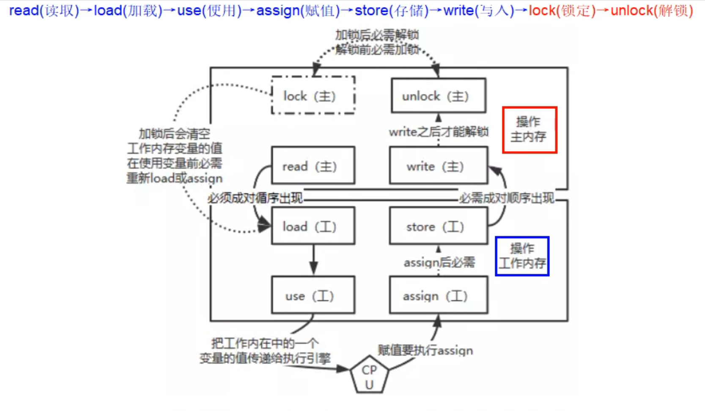

根据图示，可以把上面提到的`volatile`**可见性规则**用JMM八大原子操作来表示：线程对`volatile`变量的`read、load和use`操作必须连续出现，即变量需要使用时，必须先从主内存中读取最新值；`assign、lock、store、write、unlock`操作也必须连续出现，即线程对变量赋值后，确保线程对共享变量的独占使用，`lock`会使其它线程中对应的缓存失效，并且马上往主内存中写入新值。

对于非volatile变量是不用遵循以上顺序的，不仅不需要读和写的原子性操作顺序出现，甚至还可以重排，随缘刷新缓存。

volatile变量不能保证原子性就是因为读和写分别是原子的，但是合在一起不是原子的，通过[非原子性检测](#volatile非原子性证明)可以证明。原子性还是老老实实用`synchronized`。

有序性原理就是通过插入内存屏障，遵循JMM规则，由编译器和JVM实现。

### 适用场景

volatile常用场景有

1. 单一赋值变量。即只赋值一次的变量、可以立刻刷新到主存中，也可以用final表示常量。
2. 状态标志。比如boolean类型的flag。
3. 写操作不依赖于当前值或其它共享变量。适当替代synchronized。
4. 读操作远多于写操作。
5. 单例模式的双重验证锁DCL。

## CAS——乐观锁

> **悲观锁**：以最坏的情况看待问题，认为当前情况一定会被其它线程干预，必须要锁住线程、独占线程才能避免干预，**阻塞同步**。代表：synchronized、ReentrantLock等独占锁。性能瓶颈在cpu会大量切换上下文。
>
> **乐观锁**：以最好的情况看待问题，认为当前情况不会被干预，可以一直运行，无需加锁无需等待，**非阻塞同步**。代表：CAS、CAS实现的atomic包。性能瓶颈在cpu可能会出现长时间空转。

### CAS介绍

CAS全称CompareAndSwap（比较与交换），它是一条**CPU原语**，拥有天然的原子性。对于一个变量，比较当前值和旧值，如果相等，则把当前值更新为新值。CAS是硬件级指令，通过硬件支持实现。

### Java中CAS实现

Java对CAS原语进行了封装，实现了跨设备并兼顾易用性。现在以juc包下的`AtomicInteger`作为例子解剖Java中的原子类。

首先看一下这个原子加一的方法，直接调用的`Unsafe`类中的`getAndAddInt`方法。

```java
public final int getAndIncrement() {
    return U.getAndAddInt(this, VALUE, 1);
}
```

这个方法使用**自旋的方式**，获得当前原子对象的值，并且通过调用`weakCompareAndSetInt`尝试设置新的值，直到设置成功。

```java
@IntrinsicCandidate
public final int getAndAddInt(Object o, long offset, int delta) {
    int v;
    do {
        v = getIntVolatile(o, offset);
    } while (!weakCompareAndSetInt(o, offset, v, v + delta));
    return v;
}
```

>@IntrinsicCandidate：表示该方法可能会被JVM优化或替换为更高效的内置方法。

继续追溯源码，直接调用的`compareAndSetInt`。

```java
@IntrinsicCandidate
public final boolean weakCompareAndSetInt(Object o, long offset,
                                          int expected,
                                          int x) {
    return compareAndSetInt(o, offset, expected, x);
}
```

最终追溯到native本地方法方法。Unsafe.java中的native方法使用了C++写的unsafe.cpp，再到CPU的CAS原子指令。

```java
@IntrinsicCandidate
public final native boolean compareAndSetInt(Object o, long offset,
                                             int expected,
                                             int x);
```

### Unsafe类中的CAS

Unsafe是sun.misc包下的一个类，主要提供一些用于执行低级别、不安全操作的方法，如下图所示。

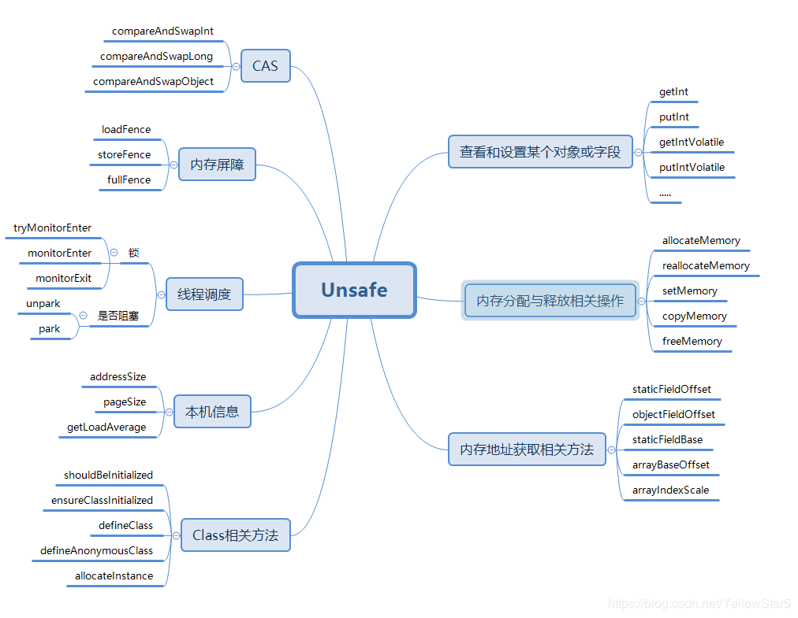

Unsafe中只提供了三个原子的CAS方法：**compareAndSwapObject、compareAndSwapInt和compareAndSwapLong。都是native方法。**它们调用的实现于unsafe.cpp的本地方法。

```cpp
UNSAFE_ENTRY_SCOPED(jint, Unsafe_CompareAndExchangeInt(JNIEnv *env, jobject unsafe, jobject obj, jlong offset, jint e, jint x)) {
  oop p = JNIHandles::resolve(obj); // java对象地址
  volatile jint* addr = (volatile jint*)index_oop_from_field_offset_long(p, offset); // 属性地址
  return Atomic::cmpxchg(addr, e, x); // 交换属性地址中的值
} UNSAFE_END
```

可以看到，cpp中使用`Atomic::cmpxchg`来实现比较和替换，更新属性地址中的值。

`Atomic::cmpxchg`是一个系统级指令，不同的系统内核有不同的实现指令。如果是多核处理器，为`cmpxchg`指令添加`lock`前缀，确保指令的原子性。

> **lock前缀**：lock前缀可以在某些指令前加上，当lock信号被声明后，锁定总线，独占共享内存，保证指令的原子性。LOCK#信号就是**总线锁**，但是总线锁的开销太大，现在的新cpu都是采用以**缓存锁**的形式实现LOCK#信号，对cpu缓存中的缓存行锁定，在锁定期间其它核不能同时缓存此数据，释放后使其它线程响应的cache line（缓存行）失效。

与 `compareAndSwapInt` 和 `compareAndSwapLong` 直接操作地址中的数值不同，`compareAndSwapObject` 操作的是地址中的对象引用。比较判断当前引用地址和预期引用地址是否是同一个对象引用地址，如果不是，就把当前地址中的值修改为性的引用。`compareAndSwapObject`不会修改对象本身，而是修改该地址中保存的对象引用。

### CAS的缺点

- CPU空转问题
- ABA问题——只关心值，不关心是否被修改过

## 原子类

原子类是线程安全的，保证了原子性、可见性和有序性，在原子类中维护的值使用`volatile`修饰保证可见性，或者使用`final`修饰，底层实现`Unsafe`和`VarHandle`保证原子性。

> JDK9后，官方推荐使用`java.lang.invoke.Varhandle`来代替Unsafe大部分功能，更安全，更高性能。Varhandle随着时间的推移逐渐代替Unsafe，JDK17中原子类大部分都已经使用Varhandle。这个先按下不表，可能会在以后来讲解一下它。

通过查找juc.atomic包下的原子类型，一共可以找到12个。

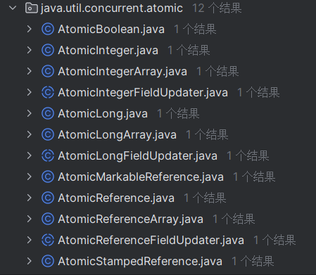

### 原子更新基本类型

- **AtomicInteger**：原子整数。
- **AtomicLong**：原子长整数。
- **AtomicBoolean**：原子布尔值。

这三个原子类的使用基本一致，值得注意的是CAS提供的原子操作直接支持`int`和`long`类型的变量，所以`AtomicInteger`和`AtomicLong`是直接按照上面示例中的方法调用流程，而`AtomicBoolean`是通过维护一个`int`值来区分`boolean`状态。

### 原子更新数组

- **AtomicIntegerArray**：原子整型数组。
- **AtomicLongArray**：原子长整型数组。
- **AtomicReferenceArray**：原子引用类型数组。

无论哪个原子数组类型，都是在内部维护一个`final`数组，通过数组下标（内存偏移量）去定位某个值的内存地址，对其进行CAS原子操作。

### 原子更新引用类型

- **AtomicReference**：原子更新引用类型。
- **AtomicStampedReference**：原子更新引用类型, 内部使用Pair来存储元素值及其版本号。
- **AtomicMarkableReferce**：原子更新带有标记位的引用类型。

`AtomicStampedReference`使用一个版本号来记录修改情况，可以知道这个对象是否被修改和被修改了多少次，**解决了CAS的ABA问题**。

它维护的是一个`Pair`内部类对象，当中存放的是需要原子操作的对象和版本号。

```java
private static class Pair<T> {
    final T reference;
    final int stamp;
    private Pair(T reference, int stamp) {
        this.reference = reference;
        this.stamp = stamp;
    }
    static <T> Pair<T> of(T reference, int stamp) {
        return new Pair<T>(reference, stamp);
    }
}
```

每次设置新值，通过实例新的`Pair`对象，使用CAS修改`AtomicStampedReference`维护的`Pair`对象，同时更新了新值和版本号。

`AtomicMarkableReferce`于上者差不多，使用boolean标志位来代替版本号，旨在表示值是否被更新过。

`AtomicMarkableReferce`和`AtomicStampedReference`的方法声明中没有一个是需要自旋的，因为版本号和标志位的意义是明确的，如果目标旧版本号或者旧标志位与当前不同，那么表示这个更新应该过期。

```java
public boolean compareAndSet(V   expectedReference,
                             V   newReference,
                             int expectedStamp,
                             int newStamp) {
    Pair<V> current = pair;
    return
        expectedReference == current.reference &&
        expectedStamp == current.stamp &&
        ((newReference == current.reference &&
          newStamp == current.stamp) ||
         casPair(current, Pair.of(newReference, newStamp))); // casPair就是原子更新Pair对象
}
```

### 原子更新字段类

- **AtomicIntegerFieldUpdater**: 原子更新整型的字段的更新器。
- **AtomicLongFieldUpdater**: 原子更新长整型字段的更新器。
- **AtomicReferenceFieldUpdater**: 原子更新引用对象字段。

以线程安全的方式操作非线程安全对象内的某些字段，更新的对象属性必须使用`volatile`修饰符。它们使用反射机制来获得类中指定属性，获得属性在类中的偏移量，然后通过对象内存加偏移量的地址进行CAS。

既然使用反射机制，就要确保反射能正确获得类属性，有几条需要注意的：

- 字段必须是`volatile`类型的，用来确保可见性的。
- 字段只能是当前类的非`privite`字段，不能是父类字段。子类字节码不直接包含父类的字段，并且源码中没有使用到`getSuperclass`来加载父类字节码。
- 只能是实例变量，不能是类变量。虽然类变量存在该类字节码中，但它不属于对象级的字段，在`native`方法`objectFieldOffset0`中报错
- 只能是可修改变量，不能是`final`变量，因为final的语义就是不可修改。实际上final的语义和volatile是有冲突的，这两个关键字不能同时存在。

### LongAdder

#### LongAdder简介

`LongAdder`是整数加法器，提供**简单的线程安全的加减法计算**，与`AtomicLong`功能类似，理论上都是维护一个`Long`整数，但是实现原理上不同，`LongAdder`在高并发场景下能有**更高的效率**。官方推荐在并发特别高的情况下使用`LongAdder`或者其兄弟类。

#### 原理

`LongAdder`的原理可以用**“热点分散”**来总结，在多线程高并发下从对单一的数值进行原子操作到**对多个数值分散进行原子操作**。

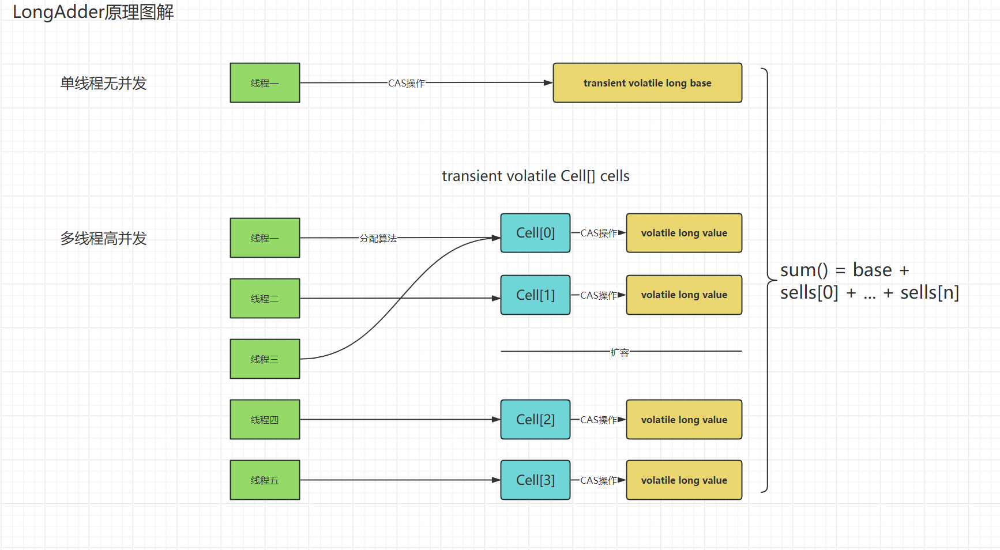

从源码层面分析，`LongAdder`中都是对父类`Striped64`的封装，重点看一下它是如何实现上方图片的**“热点分散”**。

```java
# LongAdder.java
public void add(long x) {
    // cs: 维护的cell数组；b：base值；m：cs长度；c：分配线程到某个的cell中
    Cell[] cs; long b, v; int m; Cell c;
    if ((cs = cells) != null || !casBase(b = base, b + x)) {
        int index = getProbe();
        boolean uncontended = true;
        if (cs == null || (m = cs.length - 1) < 0 ||
            (c = cs[index & m]) == null ||
            !(uncontended = c.cas(v = c.value, v + x)))
            longAccumulate(x, null, uncontended, index);
    }
}
```

初始Cell数组为空时，数组会直接进行CAS操作`base`，这是在没有并发的情况下。当并发数开始增长，有一个线程对`base`的CAS失败了，就会调用父类方法`longAccumulate（x, null, true, index)`，此时就会创建`Cell`数组，并实例化当前线程进入的那一个`Cell`对象，让线程CAS Cell对象中的`value`值，并在此之后都不再修改`base`，线程直接进入到算法分配到的`Cell`对象中修改其`value`值。sum公式如下：
$$
value=base+ 
i=0
∑
n
​
 Cell[i]
$$
`longAccumulate`是`Striped64`中最重要的方法，其中包含分配Cell数组，懒汉式的实例Cell对象，扩容数组。Cell数组的大小以`n << 1`扩容，直到超过CPU核心数大小。在数组初始化和Cell对象初始化过程中，巧妙的利用了[CAS无限自旋一个标志位确保初始化完成](#CAS自旋标志位确保完成任务)，这个知道就好，不推荐在实际业务中使用。

OK了，讲完代码方面的原理，我们再来谈谈硬件层面中有一个值得我们了解的小知识。前面讲过CPU的**三级缓存和缓存锁**，为了提高IO效率，CPU在加载内存到缓存中时并不是只加载那一个数据，而是**把周围的64/128个字节的数据都加载到缓存中**，这一次加载的64/128个字节就是**缓存行**。CAS通过LOCK信号来进行独占缓存行，解锁后会使其它CPU中的响应缓存行失效。在Cell数组中，元素是物理有序排列的，当CPU读取一个Cell元素[0]并需要进行CAS操作前，会把旁边的元素[1]也读到同一行缓存行中，那么如果旁边的元素[1]也在CAS呢？就会使我当前CPU的这个缓存行失效，迫使CPU重新缓存数据，实际上，CPU都不是修改元素[1]的值，就因为缓存锁和数据一致性却导致要修改的元素[0]的值也失效了。解决这个问题的突破点就是不让Cell元素在一个缓存行中同时出现，我们可以在Cell对象中加入一些无用的字节**填充缓存行**，比如定义8个long（64个字节，假设缓存行64字节，那么同一个Cell元素就有大概率不出现在同一个缓存行）。Java 8引入了*sun.misc.Contended*注解（Java 9将其重新打包在*jdk.internal.vm.annotation*包下），以防止虚假共享，默认会使对象或字段填充128个字节。源码的Cell类上就有这个注解。

```java
@jdk.internal.vm.annotation.Contended static final class Cell {}
```

#### 相似类

除了`LongAdder`，还有以下类有相似的功能，`*Accumulator`可以指定计算公式，指定初始值。实际上`*Adder`是`*Accumulator`的一个特例，只是为了简化使用做了类似初始值默认为0这样的封装。

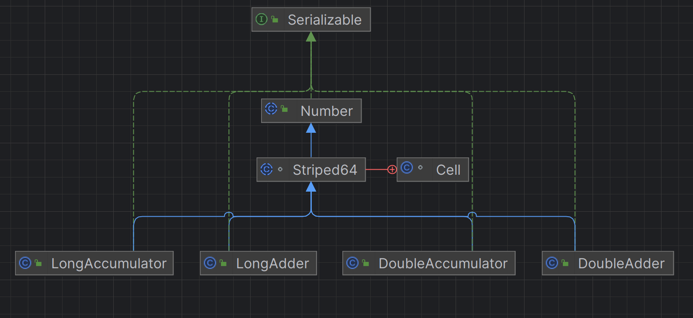

## final关键字

==关键词：有序性、完全初始化、不可变引用==

### final介绍

`final`不可变变量，可以用在类、方法、变量上，使用在不同域中有不同的效果。

- 不可变类：不可继承。
- 不可变方法：不可重写。
- 不可变字段：不可重新赋值，分为编译期赋值（声明时赋值）和运行时赋值（构造函数中赋值）。

`final`可以修饰基本类型和引用类型，修饰基本类型时不可修改变量的值，修饰引用类型时不可修改变量引用的对象，但是可以修改被引用对象中的内容。

`final`可以确保引用对象的可见性：一是final确保引用对象在构造函数完成前完成初始化；二是final不可变，不存在因为数据一致性问题，导致引用被修改，**但是不保证引用对象的内容的可见性**。

简单提一下`final`基础，主要放在final的原理和在多线程下的影响。

### 多线程下的final

对象创建过程大致分为两个：

1. 分配内存：为当前初始化对象分配内存，并为字段设置默认值
2. 执行构造函数：为字段设置值

我们希望对象完成了以上两步，即对象初始化之后，对象的引用才被赋值到变量中，此时才能通过`x = object.xx`的方式访问对象中的内容，但是因为指令重排，对象的引用可能不在对象完成初始化之后就赋值给了变量，此时对象就是部分初始化状态。下图中所示是正常的初始化过程。

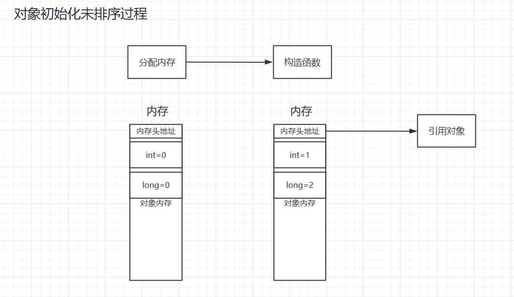

在引用对象未完成初始化，那么此时如果有其它线程访问对象中的变量，那么就可能会读取到错误的默认值。使用final修饰的字段，就不会出现这种情况，保证该字段在被访问之前final变量被完全初始化，得益于final的**有序性**。

**final域排序规则：**

- **写规则**：禁止对final域的写与构造函数外的操作重排序。
- **读规则**：禁止初次读对象与读final域的重排序。

再来深入分析一下这两条规则。

写规则要求编译器在final域写之后，构造函数返回之前插入一个StoreStore屏障，**确保引用地址赋值不会跑到final写入之前**。读规则要求编译器在初始读final域之前插入LoadLoad屏障，所以要成功完成了对象的读，才能读final域。这两个规则都是保证了final域在对象发布引用之前必须可见。

针对final修饰引用数据类型，final域写**增加**了这样的规则：在构造函数内对一个final修饰的对象的成员域的写入，与地址引用赋值不能重排序。final引用对象在所属对象的地址发布之前必须被正确构造。

总的来说，（不使用锁的情况下）final保证了在多线程中，属性的可见性和正确初始化，防止出现访问的变量未被初始化（0或者null），导致任务出错。

## 线程池

**什么是线程池？**

线程池ThreadPool，字面意思就是装有很多线程的池子，实际上确实如此，但比池子拥有更复杂的功能。线程池中管理了一些线程，它在适当的时机创建线程和销毁线程，使线程可以在多线程任务的情况下使线程复用，线程池一般会有一个任务队列，提交的任务可能会交给线程执行，或者新增到队列中，让正在忙碌的线程稍后再执行，减少消耗的同时提升了线程的工作效率。

## 异步编程


### 自定义线程池

在深入大神的线程池实现之前，尝试自己实现一个简单的线程池，包括任务队列TaskQueue、线程池ThreadPool、线程行为ThreadRun等，在配套的代码中有。

### ThreadPoolExecutor


# 扩展

## 1. @FunctionalInterface函数式接口

在`Runnable`接口上有这么一个注解`@FunctionalInterface`，表示该接口是一个函数式接口，是一个有且仅有一个抽象方法，但是可以有多个非抽象方法的接口。函数式接口可以使用Lambda表达式来表示一个接口实例，作用和匿名类相似，但简化了书写，这是匿名类和lambda表达式的区别：


## 2. 防止while(ture)造成的CPU占用100%

某些线程可能在等待特定条件或事件时采用忙等待的方式，这意味着线程会不断地执行无意义的循环以等待条件满足。这种情况下，线程会持续占用 CPU 资源，导致其使用率接近或达到 100%。这时可以使用`yield`或`sleep`来让出cpu使用权，这是对于无需锁同步的场景，否则可以使用wait或条件变量达到类似的效果。

## 3. wait/notify如何针对某个线程进行唤醒

`notify()`和`notifyAll()`都不能对针对某一个线程进行唤醒，但是可以在代码角度进行设计，避免**虚假唤醒**。比如线程唤醒的条件变量，在线程中使用`while`循环来判断变量的值，假设当使用`notify`时，唤醒的线程没有达到条件，则再次进入`wait`循环中等待一下次唤醒。

# 案例

## 设计模式——两阶段中止（TwoPhaseTermination）

```java
this.listening = new Thread(() -> {
    while(true) {
        Thread thread = Thread.currentThread();
        //中断处理
        if (thread.isInterrupted()) {
            log.debug("数据处理");
            break;
        }
        try {
            thread.sleep(1000);
            log.debug("正在监听");
        } catch (InterruptedException e) {
            log.debug("收到中断信号");
            //确定是否中断
            thread.interrupt(); //重新设置中断信号
        }
    }
});
```

[return](#打断任务)

## 线程安全的组合方法

```java
public static void main(String[] args) {
    // 线程安全的map
    HashTable table = new HashTable();
    //线程1
    new Thread(() {
        //组合使用线程安全（synchronized)的方法
        if (!table.contains("a")) {
            table.put("a", 1);
        }
    }).start;
    //线程2
    new Thread(() {
        //组合使用线程安全（synchronized)的方法
        if (!table.contains("a")) {
            table.put("a", 2);
        }
    }).start;
}
```

在这个实例中，我们想要的结果只保存一个a，当a已经存在时就不要在table上插入新的a。事实是，虽然单个方法是线程安全的，但是这样组合使用，并不是线程安全的。假设a不存在，线程1抢到锁，判断不存在a，释放锁，当进入put方法前，还需要拿到锁，这个时候就可以被线程2拿到锁，判断不存在a，释放锁，此时，两个线程都在抢夺下一个锁，在两个单位时间后都执行了put a，导致第一个次的value a被修改。[return](#常见线程安全类)

## 保护性暂停之解耦等待和生产

```java
public class GuardedSuspensionDecoupling {
    public static void main(String[] args) throws InterruptedException {
        for (int i = 0; i < 5; i++) {
            new Consumer().start();
        }
        Thread.sleep(1000);
        //针对消费者进行推送
        for (Integer id : DecouplingpObject.getIds()) {
            new Producer(id, id+"").start();
        }
    }
}
//消费者
@Slf4j(topic = "c.consumer")
class Consumer extends Thread {
    @Override
    public void run() {
        int guardedObjectId = DecouplingpObject.createGuardedObject();
        log.debug("等待结果对象{}", guardedObjectId);
        GuardedObject guardedObject = DecouplingpObject.getGuardedObject(guardedObjectId);
        try {
            Object result = guardedObject.getResult(5000);
            log.debug("获得结果对象{}结果：{}", guardedObject, result);
        } catch (InterruptedException e) {
            throw new RuntimeException(e);
        }

    }
}
//生产者
@Slf4j(topic = "c.producer")
class Producer extends Thread {
    private int toId; //消费的对象
    private String meg; //生产内容

    public Producer(int toId, String meg) {
        this.toId = toId;
        this.meg = meg;
    }

    @Override
    public void run() {
        log.debug("服务消费对象：{}", toId);
        GuardedObject guardedObject = DecouplingpObject.getGuardedObject(toId);
        guardedObject.setResult(meg);
    }
}
//解耦对象，使生产者和消费者解耦，统一管理生产者和消费者的一对一关系。
class DecouplingpObject {
    //线程安全的map，保存结果对象的集合
    private static final Hashtable<Integer, GuardedObject> guardedObjectTable = new Hashtable<>();
    private static int count = 1;

    private static synchronized int generateId() {
        return count++;
    }
    public static GuardedObject getGuardedObject(int id) {
        return guardedObjectTable.get(id);
    }
    //生成一个结果对象，并加入表中维护
    public static int createGuardedObject() {
        int id = generateId();
        guardedObjectTable.put(id, new GuardedObject(id));
        return id;
    }

    public static Set<Integer> getIds() {
        return guardedObjectTable.keySet();
    }
}
//结果对象，用来等待和获取结果的，生产者和消费者一对一。
class GuardedObject {
    private final Integer id;
    private Object result;

    public GuardedObject(Integer id) {
        this.id = id;
    }
    public synchronized Object getResult(long timeout) throws InterruptedException {
        if (timeout > 0) {
            long start = System.currentTimeMillis();
            long delay = timeout;
            do {
                wait(delay);
            } while (result == null && (delay = start + timeout - System.currentTimeMillis()) > 0);
        } else if (timeout == 0) {
            while (result == null) {
                this.wait();
            }
        }
        return this.result;
    }
    public synchronized void setResult(Object x) {
        this.result = x;
        this.notifyAll();
    }
    public Integer getId() {
        return id;
    }
}
```

[return](#解耦等待和生产)

## 工作内存和主存数据不同步问题

```java
public class Main {
    static boolean flag = true; // 不能保证及时提交内存和刷新缓存。
    public static void main(String[] args) {
        new Thread(() -> {
            System.out.println("start......");
            while (flag) { // 空循环体，即使修改了flag也不会停止。

            }
            System.out.println("end........");
        }).start();

        try {
            sleep(500);
        } catch (InterruptedException e) {
            throw new RuntimeException(e);
        }
        flag = false;
        System.out.println("已修改flag");
    }
}
```

[return](#提供可见性)

## volatile非原子性证明

```java
public class VolatileNonAtomicTest {
    volatile int res = 0;
    void add() { // 非原子操作，没有synchronized确保原子性，idea提示非原子操作。
        res++;
    }
    public static void main(String[] args) {
        VolatileNonAtomicTest volatileNonAtomicTest = new VolatileNonAtomicTest();
        Thread main = Thread.currentThread();
        for (int i = 0; i < 10; i++) {
            int finalI = i;
            Thread thread = new Thread(() -> {
                for (int j = 0; j < 1000; j++) {
                    try {
                        sleep(2);
                    } catch (InterruptedException e) {
                        throw new RuntimeException(e);
                    }
                    volatileNonAtomicTest.add();
                }
                if (finalI == 9) {
                    LockSupport.unpark(main);
                }
            });
            thread.start();
            if (i == 9) {
                LockSupport.park();
            }
        }
        System.out.println(volatileNonAtomicTest.res); // 结果不能到10000，证明volatile不能保证原子性，发生了结果覆盖
    }
}
```

[return](#volatile原理)

## CAS自旋标志位确保完成任务

```java
public class CASDemo {
    AtomicInteger mark = new AtomicInteger();
    public static void main(String[] args) {
        CASDemo casDemo = new CASDemo();
        new Thread(() -> {
            casDemo.park();
            // 模拟任务
            try {
                System.out.println("开始任务");
                sleep(1000);
                System.out.println("任务结束");
            } catch (InterruptedException e) {
                throw new RuntimeException(e);
            }
            casDemo.unpark();
        }).start();
        new Thread(() -> {
            System.out.println("等待cas");
            casDemo.park();
            System.out.println("cas成功");
            casDemo.unpark();
        }).start();
    }
    public void park() {
        for (;;) {
            if (mark.compareAndSet(0, 1)) break;
        }
    }
    public void unpark() {
        mark.compareAndSet(1, 0);
    }
}
```

[return](#相似类)
