# 并发-juc

[TOC]


## 知识星球

收录一些有参考过并且有价值的内容网址。

[Java并发 - 理论基础 | Cyan's blog (willpast.github.io)](https://willpast.github.io/pages/java-thread-x-theorty/#_0-思考)

[黑马程序员深入学习Java并发编程，JUC并发编程全套教程_哔哩哔哩_bilibili](https://www.bilibili.com/video/BV16J411h7Rd/?spm_id_from=333.337.search-card.all.click&vd_source=f910f291916244672e3ab84e2dba2c6a)

[不可不说的Java“锁”事 - 美团技术团队 (meituan.com)](https://tech.meituan.com/2018/11/15/java-lock.html)

[Java等待唤醒机制wait/notify深入解析_notify唤醒-CSDN博客](https://blog.csdn.net/AttleeTao/article/details/110133661)

## 进程线程

## 并发并行

## 同步异步

## 效率提升

充分利用多核cpu的优势，使用多线程提升效率。

多核cpu的多线程存在并行，效率提升比较明显；而单核cpu不存在并行，多线程操作也是并发的，线程时间片切换花费时间，效率负提升。这是针对可以同时进行的任务而言的，但是是否可以提升效率，需要结合具体的业务，比如桌面端UI程序中，多线程就是最常用的，即使使用单核cpu，也不应该因为一个任务的执行让页面卡死，所以使用多线程也会有很大的感知差异，可以带来正反馈的操作也算是效率提升了。

## 创建线程

通过使用`Thread`线程和`Runnable`任务来新建线程。

使用`FutureTask`创建线程任务，用来处理任务有返回结果的情况。

## 用户线程和守护线程

JAVA中的线程主要分为两类：User Thread和Daemon Thread。默认创建的线程都是用户线程；守护线程是为用户线程服务的，当线程中的用户线程都执行结束后，守护线程也会跟随结束。

## 栈与栈帧

Java Virtual Machine Stacks (Java虚拟机栈)
我们都知道JVM中由堆、栈、方法区所组成，其中栈内存是给谁用的呢？其实就是线程，每个线程启动后，虚拟机就会为其分配一块栈内存。

- 每个栈由多个栈帧(Frame)组成，对应着每次方法调用时所占用的内存
- 每个线程只能有一个活动栈帧，对应着当前正在执行的那个方法

## Thread中的方法

- `run()`：线程体，是需要线程执行的内容，直接调用不会新建线程。
- `start()`：启动新线程执行run()线程体内的任务。
- `sleep()`：线程在n时间内暂停。
- `join()`：等待该线程结束。
- `yield()`：尽量让出cpu执行权给其它线程
- `interrupt()`：打断线程。
- `setDaemon()`：设置守护线程。

### interrupt()详解

#### 打断休眠

打断`sleep`、`wait`、`join`的线程。**使线程interrupt布尔值为true**，表示被打断，抛出`InterruptedException`异常，同时**清除中止状态（interrupt被设置为false**）， 打断休眠，异常处理中可以对当前线程任务进行处理，或者重新设置终止状态，这取决于程序员。

#### 打断任务

使用`interrupt()`打断线程实际上只是修改了线程的中止状态值（interrupt），不是真正的让线程停止运行，如果需要让线程停止运行，需要在任务合适的地方手动判断interrupt的值，处理停止逻辑。基于目前的知识和根据interrupt的打断原理，使用[两阶段中止](#设计模式——两阶段中止（TwoPhaseTermination）)可以优雅的停止线程。

#### 打断park

`park()`是`LockSupport`类中的一个静态方法，用来阻塞线程。`LockSupport`并发锁，主要包含两种操作，分别为阻塞操作和唤醒操作。我们更加熟悉的阻塞唤醒操作是`wait/notify`方式，它主要以Object的角度来设计。而`LockSupport`提供的`park/unpark`则是以线程的角度来设计，真正解耦了线程之间的同步。`interrupt()`可以打断用`LockSupport`阻塞的线程，让线程从`park`阻塞中释放，并且**线程标记为打断状态，但不会触发异常**。

## 线程状态

从操作系统层面，线程有5种状态，参考进程的五态模型。为了区分下面用加粗的字表示操作系统层面的状态。

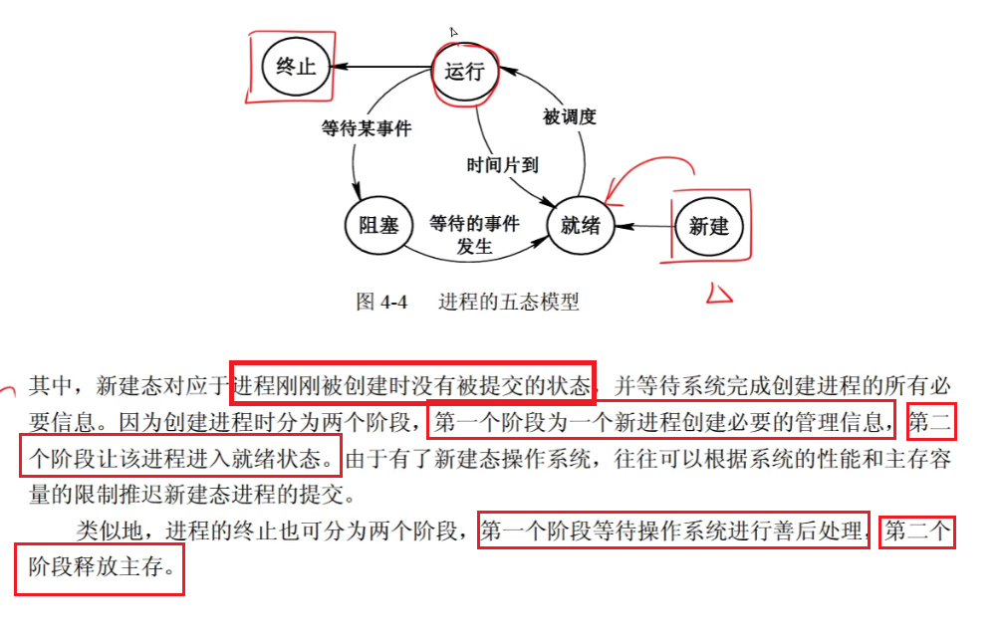

从java API层面分析，线程状态枚举中有6种状态。

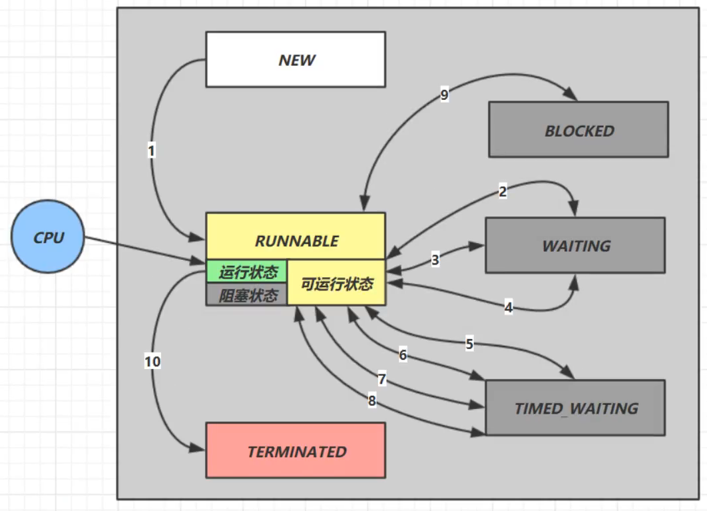

- NEW：线程对象已创建但未start。**新建**
- RUNNABLE：线程开启后的正常运行状态，包括了操作系统的**就绪**、**运行**和系统资源分配导致的**阻塞状态**，因为从代码层面上还是在运行。
- BLOCKED：阻塞状态。表示等待某个锁。**阻塞状态**
- WAITING：无限等待。**阻塞状态**
- TIME_WAITING：有限等待。**阻塞状态**
- TERMINATED：终态，线程运行结束。**终态**

## synchronized关键字详解

`synchronized`是解决临界区的静态条件发生的阻塞式手段之一。阻塞式还包括Lock，非阻塞式手段有原子变量。

>临界区。存在对共享资源的多线程读写的代码块称为临界区，会因为线程的指令交错导致共享资源的不同步。
>
>静态条件。多个线程在临界区内执行，由于代码的执行序列不同导致结果无法预测。

synchronized指定一个对象的锁，当线程获得该锁时，才可以进入`synchronized`代码块内，否则进入等待队列，直到锁被释放，可以再次尝试获取。

### 原理

**每一个对象在同一时间只与一个monitor(锁)相关联，而一个monitor在同一时间只能被一个线程获得**。当线程获得锁时，monitor计数器加一，==释放锁时，计数器减一，完全释放锁后，计数器为0==。

下图表现了对象，对象监视器，同步队列以及执行线程状态之间的关系：

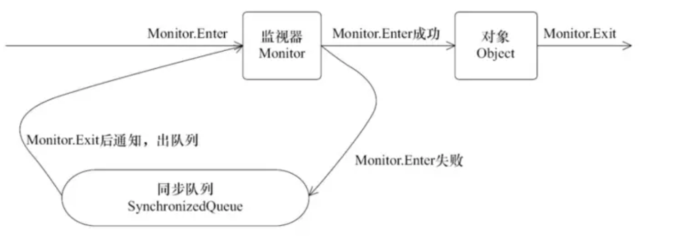

该图可以看出，任意线程对`Object`的访问，首先要获得`Object`的监视器，如果获取失败，该线程就进入同步状态，线程状态变为BLOCKED，当`Object`的监视器占有者释放后，在同步队列中得线程就会有机会重新获取该监视器。

`synchronized`关键字更多深层原理在[Monitor概念篇](#MOnitor概念)中补充

#### 重入性

请注意上面的高亮，看起来好像会存在计数器大于一的情况，难道代码块不是用完就释放吗？如果`synchronized`代码块是递归方法，或者调用了改锁的其它代码块，就会出现多次调用同步代码块的情况。思考一下，对于这种情况，线程是不是需要重新争取锁才能执行代码块呢，其实不然，线程本身已经获得了锁，在完全释放掉锁前，不需要重新获得改对象锁，而是在计数器上加一，当退出代码块后，计数器减一，这就是`synchronized`的重入性。

### 锁对象

静态方法中只能使用字节码（静态）对象锁，在静态方法上使用字节码对象锁。

非静态方法中可以使用非静态对象、字节码对象和`this`作为锁，在非静态方法上使用this对象锁。


## 谈谈线程安全

### 成员变量和静态变量是否线程安全？

- 如果它们没有共享，则线程安全
- 如果它们被共享了，根据它们的状态是否能够改变，又分两种情况
  - 如果只有读操作，则线程安全
  - 如果有读写操作，则这段代码是临界区，需要考虑线程安全

### 局部变量是否线程安全？

- 局部变量是线程安全的
- 但局部变量引用的对象则未必
  - 如果该对象没有逃离方法的作用访问，它是线程安全的
  - 如果该对象逃离方法的作用范围，需要考虑线程安全

### 常见线程安全类

- String
- Integer
- StringBuffer
- Random
- Vector
- Hashtable
- java.util.concurrent包下的类

其中，String、Integer是不可变类，不可变类对象中的值都是用final修饰的，并且方法返回的都是新对象，不会因为当前实例的值改变导致的错误。对于final的更多知识点在接下来的内容中介绍。

除了不可变对象外，多个线程调用它们同一个**实例**的某个方法时，是线程安全的。也可以理解为

- 它们的每个方法是原子的
- [但注意它们多个方法的组合不是原子的](#线程安全的组合方法)

### 继承可能会破坏线程安全

假设你设计了一个线程安全的类，现在有个人想对你的类进行修改，继承了过去，并且重写了一些方法，就可能导致本来安全的方法变得不安全，使用final修饰类防止继承可以有效解决这个问题。

## Monitor概念

Monitor被翻译为“监视器”或者“管程”，Monitor是Java中一个底层机制，用于确保同一时间只有一个线程能够执行 `synchronized` 代码块或方法。它负责管理线程对某个对象的独占访问，并处理线程的挂起和唤醒。结合对象的锁状态（存储在对象头中）一起工作。

### 对象头

讲monitor之前，首先简单了解一下对象头。以下对象头中锁状态，都是为`synchronized`关键字设计的（gc状态不是），为了优化和管理线程同步操作。

这里以32为系统为例。（64位对象头Mark Word区域64位，响应的属性区域大小也会更大）

普通对象

```tex
|------------------------------------------------------------------------------------------------|
|                                   Object Header (64bits)                                       |
|-----------------------------------------------|------------------------------------------------|
|                Mark Word (32bits)             |             Class Word (32bits)                |
|-----------------------------------------------|------------------------------------------------|
```

数组对象

```tex
|--------------------------------------------------|--------------------------------------------------|
|                                      Object Header (96bits)                                         |
|---------------------------------|---------------------------------|---------------------------------|
|        Mark Word (32bits)       |       Class Word (32bits)       |      array length (32bits)      |
|---------------------------------|---------------------------------|---------------------------------|
```

其中Mark Word结构

```tex
|---------------------------------------------------------------|--------------------|
|                     Mark Word(32bits)                         |       state        |
|---------------------------------------------------------------|--------------------|
|   hashcode(25bits)  |  age(4bits)  |   biased_lock:0   |  01  |       Unlocked     | （无锁）
|---------------------------------------------------------------|--------------------|
| thread(23bits) |epoch(2bits) |age(4bits) | biased_lock:1 | 01 |       Biased       | （偏向锁）
|---------------------------------------------------------------|--------------------|
|                  ptr_to_lock_record(30bits)            |  00  | Lightweight Locked | （轻量级锁）
|---------------------------------------------------------------|--------------------|
|                  ptr_to_heavyweight_monitor(30bits)    |  10  | Heavyweight Locked | （重量级锁）
|---------------------------------------------------------------|--------------------|
|                                                        |  11  |    Marked for GC   | （被gc回收）
|---------------------------------------------------------------|--------------------|
```

### 锁的膨胀

在一个线程运行到synchronized时，锁对象的对象头存储的信息会发生变化，锁标志位也会发生改变。假设当前对象为无锁状态（没有线程在临界区内），其中一个线程运行到了临界区，锁对象头的markword区域更新内容，变为偏向锁状态。此时另一个线程运行到该代码块，就会跟第一个线程发生锁竞争，两个线程公平竞争，那么撤销偏向锁、锁状态升级到轻量锁。如果又有多的线程竞争，那么继续膨胀锁状态到重量级锁，MarkWord区域保存monitor地址，此时，对象关联到一个monitor，由monitor去管理线程。

#### 偏向锁

偏向锁是指一段同步代码一直被一个线程所访问，那么该线程会自动获取锁，降低获取锁的代价。

在大多数情况下，锁总是由同一线程多次获得，不存在多线程竞争，所以出现了偏向锁。其目标就是在只有一个线程执行同步代码块时能够提高性能。

当一个线程访问同步代码块并获取锁时，会在**Mark Word里存储锁偏向的线程ID**。在线程进入和退出同步块时不再通过CAS操作来加锁和解锁，而是检测Mark Word里是否存储着指向当前线程的偏向锁。引入**偏向锁是为了在无多线程竞争的情况下尽量减少不必要的轻量级锁执行路径**，因为轻量级锁的获取及释放依赖多次**CAS**原子指令，而偏向锁只需要在置换ThreadID的时候依赖一次CAS原子指令即可。

偏向锁只有遇到其他线程尝试竞争偏向锁时，持有偏向锁的线程才会释放锁，线程不会主动释放偏向锁。偏向锁的撤销，需要等待全局安全点（在这个时间点上没有字节码正在执行），它会首先暂停拥有偏向锁的线程，判断锁对象是否处于被锁定状态。撤销偏向锁后恢复到无锁（标志位为“01”）或轻量级锁（标志位为“00”）的状态。

在对象为偏向锁状态时，观察Mark Word结构，没有hashcode的存储位置，所以**偏向锁和hashcode是互斥存在**的。由于hashcode的延迟生成，当第一次使用对象hashcode之后，才会关闭对象偏向锁。

偏向锁满足一定条件可以重偏向和自动撤销偏向，这是由jvm对该对象锁的监控决定，不展开。

> 偏向锁在JDK 6及以后版本JVM里是默认启用的。可以通过JVM参数关闭偏向锁：-XX:-UseBiasedLocking=false，关闭之后程序默认会进入轻量级锁状态。
>
> **JDK 15之后取消了偏向锁，锁状态为正常、轻量级、重量级**，原因是偏向锁性能收益小，复杂性和维护成本大。

#### 轻量级锁

是指当锁是偏向锁的时候，被另外的线程所访问，偏向锁就会升级为轻量级锁，其他线程会通过**自旋**的形式尝试获取锁，不会阻塞，从而提高性能。

在代码进入同步块的时候，如果同步对象锁状态为无锁状态（锁标志位为“01”状态，是否为偏向锁为“0”），虚拟机首先将在当前线程的**栈帧**中建立一个名为锁记录（Lock Record）的空间，用于存储锁对象目前的Mark Word的拷贝，然后拷贝对象头中的Mark Word复制到锁记录中。

拷贝成功后，虚拟机将使用**CAS**操作尝试将对象的Mark Word更新为指向Lock Record的指针，并将Lock Record里的owner指针指向对象的Mark Word。

如果这个更新动作成功了，那么这个线程就拥有了该对象的锁，并且对象Mark Word的锁标志位设置为“00”，表示此对象处于轻量级锁定状态。

如果轻量级锁的更新操作失败了，虚拟机首先会检查对象的Mark Word是否指向当前线程的栈帧，如果是就说明当前线程已经拥有了这个对象的锁，那就可以直接进入同步块继续执行，否则说明多个线程竞争锁。

*该图表示轻量级锁的重入*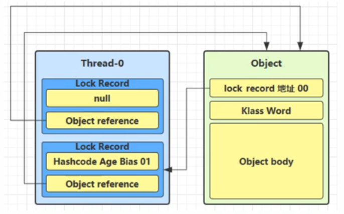

若当前只有一个等待线程，则该线程通过自旋进行等待。但是当自旋超过一定的次数，或者一个线程在持有锁，一个在自旋，又有第三个来访时，轻量级锁升级为重量级锁。

**轻量级锁，在线程少量的情况下，尽量减少了重量级锁中线程上下文切换的次数，通过线程一定时间内的自旋等待代替阻塞。**

> JDK7及以后无法控制轻量级锁的自旋，通过JVM自动判断自旋的度。

#### 重量级锁（同步锁）

本章中的Monitor就是重量锁的原理

### 工作原理

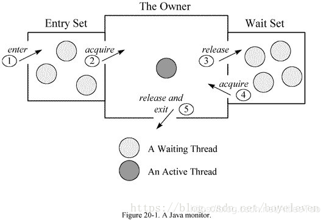

如下图所示，假设锁对象为重量级锁状态。线程2拿到锁，此时Monitor的属性Owner指向线程2，Owner线程可以访问临界区。当线程1，线程2尝试访问临界区时，会被分配到等待队列中，直到线程2彻底释放锁，Owner为空，唤醒等待队列中的线程，再次进行锁竞争。


**Monitor是Java对象与操作系统资源的结合**，每个对象都可以作为锁，作为锁就有机会（隐式）关联一个监视器对象，由JVM管理，监视器中有对操作系统资源的使用，比如信号量、互斥量、线程调度。

## wait/notify

`wait/notify`等待/唤醒机制，是**线程通信**的一种方式，与Monitor有密切关系。使用`wait/notify`必须当前线程在**`synchronized`**块中，且使用的对象必须是当前锁对象，否则会出现**`IllegalMonitorStateException`(非法监视器状态异常)**。线程使用锁对象`wait`会进入等待状态，并且**释放锁**。

如下图所示，`wait`使线程进入Monitor的等待集合中，线程处于WAITING等待状态，被`notify`唤醒后将会进入等待队列中继续竞争锁。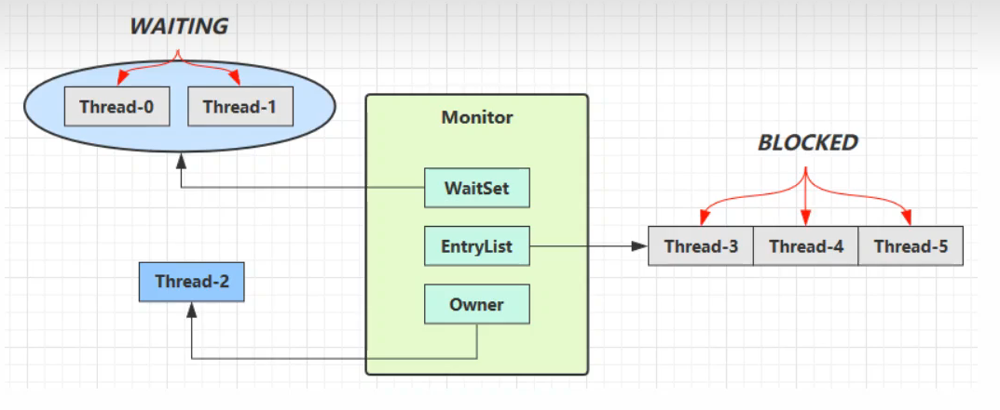

### 方法说明

- `wait()`：在线程获取到锁后，调用锁对象的本方法，线程释放锁并且把该线程放置到与锁对象关联的等待队列（等待线程池）。
- `wait(long timeout)`：等待指定的毫秒数，如果超过指定时间则自动把该线程从等待队列中移出。
- `wait(long timeout, int nanos)`： 与上边的一样，只不过超时时间粒度更小，即指定的毫秒数加纳秒数。
- `notify()`： 唤醒一个在与该锁对象关联的等待队列的线程，一次唤醒一个，而且是任意的。
- `notifyAll()`：唤醒全部：可以将该锁Monitor线程池中的所有wait() 线程都唤醒。

### wait和sleep的区别

**`wait/notify`是对象行为**。`wait`和`notify`是Java对象行为，因为它们是定义在`java.lang.Object`类中的方法，而不是线程或锁的特定行为。每个Java对象都有可能被用作锁，并且任何对象都可以调用这些方法来管理线程同步。需要搭配`synchronized`使用。**会释放锁**。

`sleep`是Thread类方法，不强制搭配`synchronized`使用，**不会释放锁**。

### 同步设计模式——保护性暂停（Guarded Suspension)

在多线程通信中，在一个线程需要等待另一个线程的执行结果，如何避免虚假唤醒和保证有限等待的正确性，保护性暂停可以有效解决这些问题。需要一个对象来管理结果。

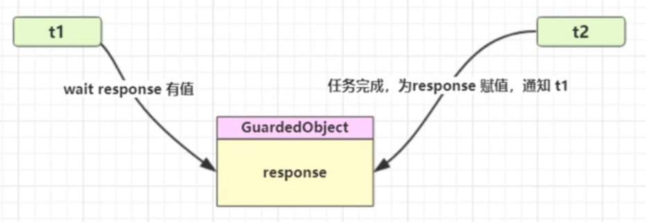

观察以下管理执行结果的类，循环语句条件`result == null `和 `(delay = start + timeout - System.currentTimeMillis()) > 0`分别就虚假唤醒和有限等待问题做出了解决。

```java
class GuardedObject {
    Integer result;

    /**
     * 同步获取数据方法，使用保护性暂停设计模式
     *
     * @param timeout 超时时间
     * @return
     */
    public synchronized Integer getResult(long timeout) throws InterruptedException {
        if (timeout > 0) {
            long start = System.currentTimeMillis(); //开始等待时间
            long delay = timeout; //剩余等待时间
            do {
                wait(delay);
            } while (result == null && (delay = start + timeout - System.currentTimeMillis()) > 0);
        } else if (timeout == 0) {
            while (result == null) {
                this.wait();
            }
        }
        return this.result;
    }

    public synchronized void setResult(int x) {
        this.result = x;
        this.notifyAll();
    }
}
```

如果看懂这个代码，恭喜你！同时理解了`Thread.join()`方法原理。与上方代码不同的是，join判断的是线程是否存活。

#### 解耦等待和生产

如果需要在多个类之间使用`GuardedObject`对象，作为参数传递不是很方便，因此设计一个用来解耦的中间类，这样不仅能够解耦【结果等待者】和【结果生产者】，还能够同时支持多个任务的管理。[代码区](#保护性暂停之解耦等待和生产)。

结合代码和图示，可以看出，在保护性暂停基础上，加了一个解耦类，用来统一和维护**一对一**的结果对象。

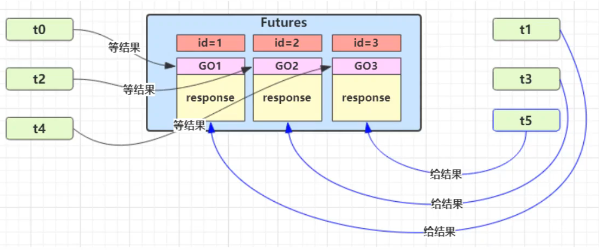

### 异步设计模式——生产者消费者模式

生产者消费者模式中解耦了生产者和消费者（线程），不需要一一对应。消息是放着一个消息队列中的，队列满足接收消息的请求时，生产者可以直接发送消息，不需要等待和关注消费者的处理；队列满时生产者等待；队列空时消费者等待。平衡生产者和消费者变得简单，如果消费者的速度比生产者生产的速度慢，那么可以添加消费者，反之同理。

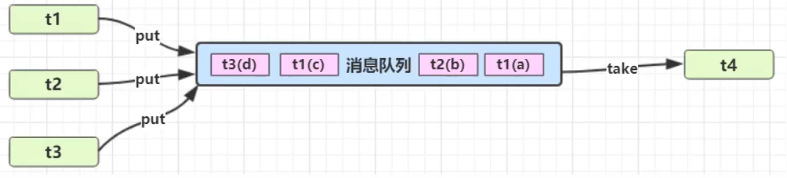

以下代码是一个简单消息队列的实现。

```java
@Slf4j(topic = "c.queue")
class MessageQueue {
    private final LinkedList<Message> queue = new LinkedList<>();
    private final int capacity; //队列大小

    public MessageQueue(int capacity) {
        this.capacity = capacity;
    }

    //存
    public void put(Message message) throws InterruptedException {
        synchronized (queue) {
            while (queue.size() == capacity) {
                log.debug("队列满了，等一下");
                queue.wait(); //满队列 等待
            }
            queue.addLast(message);
            queue.notifyAll(); //在空队列的情况下唤醒一下等待的消费者。
        }
    }
    //取
    public Message take() throws InterruptedException {
        synchronized (queue) {
            while (queue.isEmpty()) {
                log.debug("队列空了，等一下");
                queue.wait(); //等待消息
            }
            Message meg = queue.removeFirst();
            queue.notifyAll(); //在满队列的情况下唤醒等待存放的生产者。
            return meg;
        }
    }
}
```

## LockSupport

LockSupport用来创建锁和其他同步类的基本线程阻塞原语。简而言之，当调用`LockSupport.park`时，**表示当前线程将会等待**，直至获得许可，当调用`LockSupport.unpark`时，必须把等待获得许可的线程作为参数进行传递，好让此线程继续运行。

LockSupport和每个使用它的线程都有一个许可关联（对象），管理线程的许可状态，许可且最多只有一个。`park`消耗许可，`unpark`增加许可，但累加无效。

以下图片是许可的底层实现原理。

- Parker-0。可以理解为是一个管理线程许可状态的内部数据结构。
- \_counter。许可状态。1表示拥有许可，0表示没有许可。
- \_mutex。互斥锁。确保_counter的更新操作是原子的。
- \_cond。条件变量。判断许可状态。

当线程使用`park`方法时，在条件变量中判断当前线程许可状态，如果无许可，则在条件变量中等待，直到许可重新出现，将许可置为0，并退出等待状态；如果一开始判断就有许可，则不需要等待，直接将许可置为0，并退出等待状态。

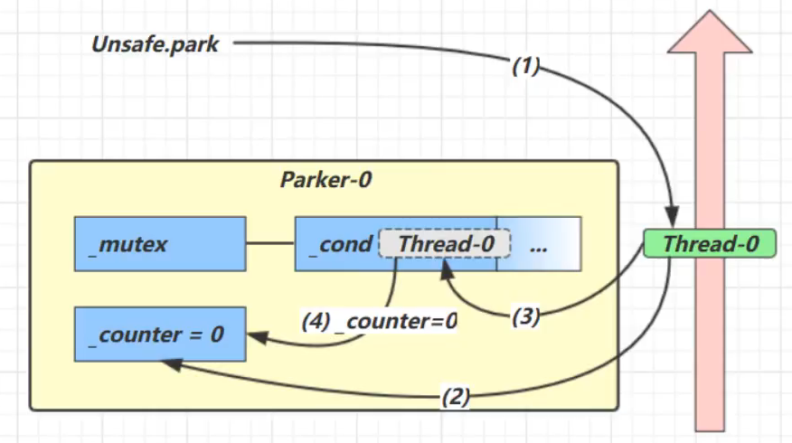

除了无参`park()`方法，还有一些带`Object blocker`和`long deadline`参数的。带时间的就是设置等待的时间，超时停止等待。`blocker`参数在线程等待前被`setBlocker(t,blocker)`用来设置`Thread`对象上的`parkBlocker`的对象，结束等待后会再次调用`setBlocker(t, null)`把对象置为空，在阻塞过程中可以通过`getBlocker(t)`方法获得某个线程的`parkBlocker`，可以通过自定义的对象用来知道线程的等待的位置或者原因。主要是用来做等待原因校验的。

### `park`和`sleep`方法的异同

- 都是**阻塞当前线程的执行，且都不会释放当前线程占有的锁资源；**
- `Thread.sleep`方法声明上抛出了`InterruptedException`中断异常，所以调用者需要捕获这个异常或者再抛出；
- `LockSupport.park`方法**不需要捕获中断异常**；
- `Thread.sleep`本身就是一个native方法；
- `LockSupport.park`底层是调用的Unsafe的native方法；


## final关键字详解

==关键词：禁止重排、完全初始化、不可变引用==

# 扩展

## 1. @FunctionalInterface函数式接口

在`Runnable`接口上有这么一个注解`@FunctionalInterface`，表示该接口是一个函数式接口，是一个有且仅有一个抽象方法，但是可以有多个非抽象方法的接口。函数式接口可以使用Lambda表达式来表示一个接口实例，作用和匿名类相似，但简化了书写，这是匿名类和lambda表达式的区别：

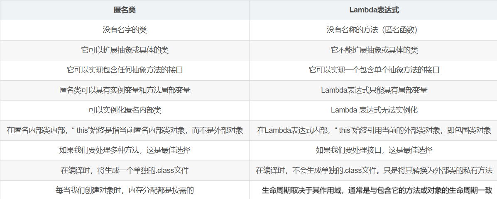

## 2. 防止while(ture)造成的CPU占用100%

某些线程可能在等待特定条件或事件时采用忙等待的方式，这意味着线程会不断地执行无意义的循环以等待条件满足。这种情况下，线程会持续占用 CPU 资源，导致其使用率接近或达到 100%。这时可以使用`yield`或`sleep`来让出cpu使用权，这是对于无需锁同步的场景，否则可以使用wait或天降变量达到类似的效果。

## 3. wait/notify如何针对某个线程进行唤醒

`notify()`和`notifyAll()`都不能对针对某一个线程进行唤醒，但是可以在代码角度进行设计，避免**虚假唤醒**。比如线程唤醒的条件变量，在线程中使用`while`循环来判断变量的值，假设当使用`notify`时，唤醒的线程没有达到条件，则再次进入`wait`循环中等待一下次唤醒。

# 代码块

## 设计模式——两阶段中止（TwoPhaseTermination）

```java
this.listening = new Thread(() -> {
    while(true) {
        Thread thread = Thread.currentThread();
        //中断处理
        if (thread.isInterrupted()) {
            log.debug("数据处理");
            break;
        }
        try {
            thread.sleep(1000);
            log.debug("正在监听");
        } catch (InterruptedException e) {
            log.debug("收到中断信号");
            //确定是否中断
            thread.interrupt(); //重新设置中断信号
        }
    }
});
```

[return](#打断任务)

## 线程安全的组合方法

```java
public static void main(String[] args) {
    // 线程安全的map
    HashTable table = new HashTable();
    //线程1
    new Thread(() {
        //组合使用线程安全（synchronized)的方法
        if (!table.contains("a")) {
            table.put("a", 1);
        }
    }).start;
    //线程2
    new Thread(() {
        //组合使用线程安全（synchronized)的方法
        if (!table.contains("a")) {
            table.put("a", 2);
        }
    }).start;
}
```

在这个实例中，我们想要的结果只保存一个a，当a已经存在时就不要在table上插入新的a。事实是，虽然单个方法是线程安全的，但是这样组合使用，并不是线程安全的。假设a不存在，线程1抢到锁，判断不存在a，释放锁，当进入put方法前，还需要拿到锁，这个时候就可以被线程2拿到锁，判断不存在a，释放锁，此时，两个线程都在抢夺下一个锁，在两个单位时间后都执行了put a，导致第一个次的value a被修改。[return](#常见线程安全类)

## 保护性暂停之解耦等待和生产

```java
public class GuardedSuspensionDecoupling {
    public static void main(String[] args) throws InterruptedException {
        for (int i = 0; i < 5; i++) {
            new Consumer().start();
        }
        Thread.sleep(1000);
        //针对消费者进行推送
        for (Integer id : DecouplingpObject.getIds()) {
            new Producer(id, id+"").start();
        }
    }
}
//消费者
@Slf4j(topic = "c.consumer")
class Consumer extends Thread {
    @Override
    public void run() {
        int guardedObjectId = DecouplingpObject.createGuardedObject();
        log.debug("等待结果对象{}", guardedObjectId);
        GuardedObject guardedObject = DecouplingpObject.getGuardedObject(guardedObjectId);
        try {
            Object result = guardedObject.getResult(5000);
            log.debug("获得结果对象{}结果：{}", guardedObject, result);
        } catch (InterruptedException e) {
            throw new RuntimeException(e);
        }

    }
}
//生产者
@Slf4j(topic = "c.producer")
class Producer extends Thread {
    private int toId; //消费的对象
    private String meg; //生产内容

    public Producer(int toId, String meg) {
        this.toId = toId;
        this.meg = meg;
    }

    @Override
    public void run() {
        log.debug("服务消费对象：{}", toId);
        GuardedObject guardedObject = DecouplingpObject.getGuardedObject(toId);
        guardedObject.setResult(meg);
    }
}
//解耦对象，使生产者和消费者解耦，统一管理生产者和消费者的一对一关系。
class DecouplingpObject {
    //线程安全的map，保存结果对象的集合
    private static final Hashtable<Integer, GuardedObject> guardedObjectTable = new Hashtable<>();
    private static int count = 1;

    private static synchronized int generateId() {
        return count++;
    }
    public static GuardedObject getGuardedObject(int id) {
        return guardedObjectTable.get(id);
    }
    //生成一个结果对象，并加入表中维护
    public static int createGuardedObject() {
        int id = generateId();
        guardedObjectTable.put(id, new GuardedObject(id));
        return id;
    }

    public static Set<Integer> getIds() {
        return guardedObjectTable.keySet();
    }
}
//结果对象，用来等待和获取结果的，生产者和消费者一对一。
class GuardedObject {
    private final Integer id;
    private Object result;

    public GuardedObject(Integer id) {
        this.id = id;
    }
    public synchronized Object getResult(long timeout) throws InterruptedException {
        if (timeout > 0) {
            long start = System.currentTimeMillis();
            long delay = timeout;
            do {
                wait(delay);
            } while (result == null && (delay = start + timeout - System.currentTimeMillis()) > 0);
        } else if (timeout == 0) {
            while (result == null) {
                this.wait();
            }
        }
        return this.result;
    }
    public synchronized void setResult(Object x) {
        this.result = x;
        this.notifyAll();
    }
    public Integer getId() {
        return id;
    }
}
```

[return](#解耦等待和生产)
